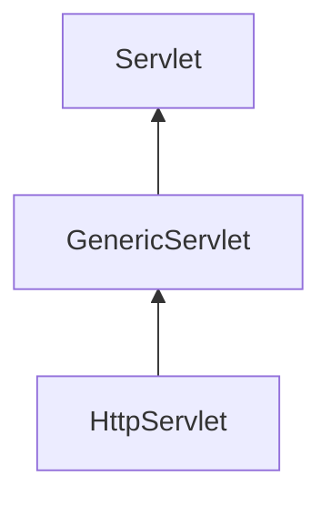
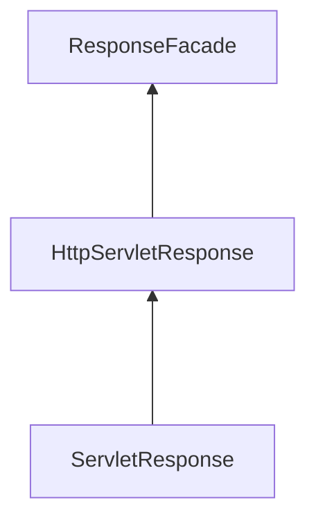

# JavaWeb 笔记

```
     __              _      __    __ 
 __ / /__ __  _____ | | /| / /__ / / 
/ // / _ `/ |/ / _ `/ |/ |/ / -_) _ \
\___/\_,_/|___/\_,_/|__/|__/\__/_.__/
                                     
```


## 一、JavaWeb 简介

### 1.1 什么是 JavaWeb？

- JavaWeb 指的是使用 Java 技术开发的 Web 应用程序。
- JavaWeb 应用程序通常由前端和后端组成。
- JavaWeb 的优点包括可移植性高、安全性好、性能稳定、开源社区活跃等。

### 1.2 JavaWeb 的历史和发展

JavaWeb 技术的历史可以追溯到上世纪 90 年代初，当时 Sun Microsystems 发布了 Java 语言和 Java Servlet 规范。1999 年，Sun 发布了 JavaServer Pages（JSP）规范，这是一种将 HTML 和 Java 代码嵌入在一起的技术，用于生成动态的 Web 页面。2004 年，JavaServer Faces(JSF)规范发布，提供了一种用于构建用户界面的组件模型，使得开发者可以更加快速地开发复杂的 Web 应用程序。为了解决一些问题，Java 社区开始推广轻量级的 JavaWeb 框架，如 Spring 和 Struts 等。这些框架提供了更加简单、灵活的开发方式，并且可以与 JavaEE 规范结合使用。此外，Java 社区也推出了新的 JavaWeb 标准，如 JavaServer Faces 2.0 和 Servlet 3.0 等。

## 二、Servlet 基础知识

### 2.1 Servlet 概述

#### 什么是 Servlet

Servlet（Server Applet），即小服务程序或服务连接器。Servlet 是 Java 编写的服务器端程序，具有独立于平台和协议的特性，主要功能在于交互式地浏览和生成数据，生成动态 Web 内容。

- 狭义的 Servlet 是指 Java 实现的一个接口。
- 广义的 Servlet 是指任何实现了这个 Servlet 接口的类。

Servlet 运行于支持 Java 的应用服务器中。从原理上讲，Servlet 可以响应任何类型的请求，但绝大多数情况下 Servlet 只用来扩展基于 HTTP 协议的 Web 服务器。

#### 生命周期

- 生命周期：指的是 一个对象从生（创建）到死（销毁）的一个过程

```java
// 1. servlet对象创建时，调用此方法
public void init(ServletConfig servletConfig);

// 2. 用户访问servlet时，调用此方法
public void service(ServletRequest servletRequest, ServletResponse servletResponse);

// 3. servlet对象销毁时，调用此方法
public void destroy();
```

- 配置 web.xml

```xml
<!--servlet的生命周期-->
<servlet>
	<servlet-name>LifeServlet</servlet-name>
	<servlet-class>cn.zs.LifeServlet</servlet-class>
<!--tomcat启动时，创建servlet对象，执行init方法 -->
	<load-on-startup>4</load-on-startup>
</servlet>
<servlet-mapping>
	<servlet-name>LifeServlet</servlet-name>
	<url-pattern>/lifeServlet</url-pattern>
</servlet-mapping>
```

* 创建
1. 默认情况下
用户第一次访问时，创建 servlet，执行 init 方法
2. 修改创建时机
   `<load-on-startup> </load-onstartup>`
   正数：4-N （服务器启动时，创建）
   补充：Tomcat 的 web.xml 里有 1,3 所以推荐 4-n
   负数（默认值）：-1 （用户第一次访问时，创建）
* 运行（提供服务）
用户每次访问时，都执行 service 方法
* 销毁
服务器正常关闭时，销毁 servlet，执行 destroy 方法

### 2.2 Servlet 体系结构



- Servlet：顶级接口，提供了五个抽象方法
- GenericServlet：抽象类，重写绝大多数的抽象方法，只需要开发者重写 Servlet
- HttpServlet：抽象类，处理 http 协议的（请求，响应），根据不同的请求方式做出不同处理

#### GenericServlet

```java
public class ServletDemo extends GenericServlet {
    @Override
    public void init() throws ServletException {
        //重写方法
    }

    @Override
    public void service(ServletRequest servletRequest, ServletResponse
            servletResponse) throws ServletException, IOException {
        //重写方法
    }

    @Override
    public void destroy() {
        //重写方法
    }
}
```

#### HttpServlet

==在HttpServlet中，只需在doPost函数中写逻辑代码即可==

使用 post 请求比 get 请求，更加安全，参数不会暴露在外。

```java
public class ServletDemo extends HttpServlet {
    @Override
    protected void doGet(HttpServletRequest req, HttpServletResponse resp)
            throws ServletException, IOException {
        this.doPost(req, resp);
    }

    @Override
    protected void doPost(HttpServletRequest req, HttpServletResponse resp)
            throws ServletException, IOException {
        //重写方法
    }
}
```

### 2.3 url-pattern 的配置方式

- 配置 web.xml

```xml
<servlet>
	<servlet-name>ServletTest</servlet-name>
	<servlet-class>cn.zs.ServletTest</servlet-class>
</servlet>

<servlet-mapping>
	<servlet-name>ServletTest</servlet-name>
    <!--在这里填写url-->
	<url-pattern>/[url]</url-pattern>
</servlet-mapping>
```

- Servlet 映射多个 url

```xml
<servlet>
	<servlet-name>ServletTest</servlet-name>
	<servlet-class>cn.zs.ServletTest</servlet-class>
</servlet>

<servlet-mapping>
	<servlet-name>ServletTest</servlet-name>
    <!--在这里填写url-->
	<url-pattern>/[url]</url-pattern>
</servlet-mapping>

<servlet-mapping>
	<servlet-name>ServletTest</servlet-name>
    <!--在这里填写url-->
	<url-pattern>/[url]</url-pattern>
</servlet-mapping>
```

####  url 映射模式

一般会访问路径：``localhost:8080/项目路径/url`

配置 url 地址取值可以是：

1. 精确匹配(掌握)：`/a` 
  
2. 目录匹配：`/a/*`
3. 后缀匹配：`*.xx 例如：*.do`

```xml
<!--目录匹配：只要浏览器符合目录匹配规则,都可以访问到这个servlet：
/a/a
/a/ab
-->
<servlet>
	<servlet-name>ServletTest</servlet-name>
	<servlet-class>cn.zs.ServletTest</servlet-class>
</servlet>

<servlet-mapping>
	<servlet-name>ServletTest</servlet-name>
	<url-pattern>/a/*</url-pattern>
</servlet-mapping>
<!--后缀匹配：只要浏览器符合后缀匹配规则，都可以访问到这个servlet
a.do
b.do
-->
<servlet>
	<servlet-name>ServletTest</servlet-name>
	<servlet-class>cn.zs.ServletTest</servlet-class>
</servlet>

<servlet-mapping>
	<servlet-name>ServletTest</servlet-name>
	<url-pattern>*.do</url-pattern>
</servlet-mapping>
```

- (常用)替代**配置 web.xml**方法：

```java
//使用注释
@WebServlet("/a")
public class A extends HttpServlet {

    @Override
    protected void doGet(HttpServletRequest req, HttpServletResponse resp) throws ServletException, IOException {
        this.doPost(req, resp);
    }

    @Override
    protected void doPost(HttpServletRequest req, HttpServletResponse resp) throws ServletException, IOException {
        //重写方法
    }
}
```


### 2.4 Servlet 请求

####  request 对象概述

request 对象是指在 Web 应用程序中客户端向服务器发送请求时，服务器端接收到请求并生成的对象。它包含了客户端请求的所有信息，例如请求的 URL、请求方法（GET、POST 等）、请求头部信息、请求体内容等。


#### 获取请求行信息

```java
//1. 获取请求方式 GET
	String getMethod()
//2. 获取项目虚拟路径（项目名）/a
	String getContextPath()
//3. 获取URL （http://localhost:8080/a/b）
//统一资源定位符（确定某一个地址）
	StringBuffer getRequestURL()
//4. 获取协议和版本号 HTTP/1.1
	String getProtocol()
//5. 获取客户端ip
	String getRemoteAddr()
        
//!使用方法(以下方法都适用)
@WebServlet("/a")
public class A extends HttpServlet {

    @Override
    protected void doGet(HttpServletRequest req, HttpServletResponse resp) throws ServletException, IOException {
        this.doPost(req, resp);
    }

    @Override
    protected void doPost(HttpServletRequest req, HttpServletResponse resp) throws ServletException, IOException {
        // req.[方法名()]
		req.getMethod()
    }
}
```

#### 获取请求头信息

```java
//1. 获取知道请求头名称对应的值，注：名称不区分大小写
	String getHeader(String name)
//2. 获取所有请求头的名称
	Enumeration<String> getHeaderNames()
        //使用
        Enumeration<String> enumeration = req.getHeaderNames();
//注：是Iterator前身
```

#### 获取请求体信息（请求参数）

- 不论 get 还是 post 请求方式，都可以使用下列方法来获取请求参数

```java
//1. 获取指定参数名的值 username=jack
	String getParameter(String name)
//2. 获取指定参数名的值数组 hobby=drink&hobby=perm
	String[] getParameterValues(String name)
//3. 获取所有参数名和对应值数组，参数名 name（key），值数组 value，封装map集合
	Map<String,String[]> getParameterMap()
```

- 中文乱码

| 名称                   | 编码解码                                   |
| ---------------------- | ------------------------------------------ |
| Get 请求                | 在 tomcat8 及以上版本，内部 URL 编码（UTF-8）  |
| Post 请求               | 客户端编码，服务器解码不一致，造成乱码现象 |
| 客户端（浏览器）的编码 | UTF-8                                      |
| 服务器默认的解码       | ISO-8859-1 拉丁文                          |

==解决乱码方法：req.setCharacterEncoding("UTF-8");==

注：指定解码必须行首

#### 请求转发

请求转发（Request forwarding）是指将来自客户端的 HTTP 请求发送到服务器集群中的其他节点进行处理的过程。当一个服务器无法处理请求时，它可以将请求转发到另一个服务器上，以便该服务器可以处理该请求并向客户端返回响应。


请求转发特点：

1. 负载均衡：请求转发技术可以实现负载均衡，将客户端的请求分布到不同的服务器上进行处理，从而提高系统的并发处理能力和吞吐量。

2. 高可用性：当某一台服务器出现故障或者负载过高时，请求转发机制可以将请求转发到其他健康的服务器上进行处理，从而保证服务的可靠性和高可用性。

3. 透明性：对于客户端来说，使用请求转发技术后，其请求会被自动转发到最合适的服务器上进行处理，客户端无需关心请求具体是由哪台服务器处理的。

4. 灵活性：请求转发技术可以灵活配置，根据业务需求进行集群的组建，同时也可以根据实际情况动态地调整服务器的负责范围和数量。


```java
//1. 通过reqeust对象，获得转发器对象
RequestDispatcher getRequestDispatcher(String url) //要跳转到url

//2. 通过转发器对象，实现转发功能（携带请求和响应对象）
void forward(ServletRequest request, ServletResponse response)

//链式编程
request.getRequestDispatcher("/b").forward(reqeust,response)
```

### 2.5 Servlet 响应

#### response 对象概述

在 Web 开发中，当客户端发送请求后，服务器会返回一个 HTTP 响应。在服务器端，开发人员可以通过创建和配置一个 response 对象来生成这个 HTTP 响应内容。response 对象包含了服务器向客户端返回的各种信息，如 HTTP 状态码、头部信息以及响应体等。


- Response 体系结构




#### 设置 Http 响应消息

```java
// 设置状态码  200 302 304 404 500
void setStatus(int sc)
```

#### 响应头

```java
// 设置指定头名称和对应的值
void setHeader(String name, String value)
```

#### 响应体

```java
//1. 字符输出流
PrintWriter getWriter()
//2. 字节输出流
ServletOutputStream getOutputStream()
//注意：在同一个servlet中，二种类型的输出流不能同时存在
```

####  响应重定向

响应重定向（Response redirection）是指在 Web 开发中，服务器接收到请求后将客户端的请求重定向到另一个 URL 的过程。当客户端访问某个 URL 时，服务器可以返回一个特殊的响应状态码和一个新的 URL，告诉客户端要重新发送请求到该新的 URL 上。


响应重定向特点：

1. 重定向可以帮助维护旧网站结构，使其在重构后仍能保持原来的搜索引擎排名。
2. 重定向也可以帮助管理 301 永久性重定向和 302 临时性重定向，这两种重定向方式对于搜索引擎排名和用户体验都有影响。
3. 重定向可能会降低页面加载速度，因为它需要花费额外的时间进行转发。
4. 过多的重定向可能会被视为“链接农场”，从而对搜索引擎排名产生负面影响。
5. 重定向还可以用于跟踪广告和分析流量来源。

```java
//方式一
// 1.设置状态码
response.setStatus(302);
// 2.设置响应头 Location
response.setHeader("Location","重定向网络地址");

//方式二
// 1.response封装专门处理重定向的方法
response.sendRedirect("重定向网络地址");
```

- 响应中文

```java
//1. 通过response获取字符输出流
PrintWriter pw = response.getWriter();
//2. 通过字符输出输出文本
pw.write("中文....");
```

- 解决中文乱码

```java
//1. 指定服务器响应编码方式
response.setCharacterEncoding("GBK");
//2. 统一浏览器和服务器编码
response.setContentType("text/html;charset=utf-8");
```

### 2.6 ？？？ServletContext

#### ServletContext 概述

在 Java Web 应用中，ServletContext 是一个 Web 应用程序的上下文环境，它代表了整个 Web 应用程序，并提供了一种机制，使得在 Web 应用程序中的各个组件之间共享信息变得容易。每个 Web 应用程序都有一个对应的 ServletContext 对象，可以通过 ServletConfig 接口的 getServletContext()方法获取。

主要作用 

1. 提供全局参数设置：ServletContext 对象可以存储全局性的参数，例如数据库连接池配置、日志记录等。这些参数可用于整个 Web 应用程序的不同组件，比如 Servlet、Filter、Listener 等。

2. 共享资源访问：ServletContext 对象还提供了一种机制，允许在 Web 应用程序中的各个组件之间共享资源。例如，可以使用 ServletContext 对象来读取系统文件或属性文件，并将其作为应用程序级别的资源进行共享。

3. 请求调度：ServletContext 对象还提供了请求调度功能，通过此功能可以将请求分发给 Web 应用程序中的其他组件进行处理，从而实现灵活的请求处理流程。

4. 监听器注册：ServletContext 对象还可以向 Web 应用程序中注册监听器，以便监听 Web 应用程序的生命周期事件和请求事件等。

5. 获取 Web 应用程序的信息：ServletContext 对象可以获取 Web 应用程序的相关信息，例如应用程序名称、上下文路径、服务器信息等。

6. 实现会话管理：ServletContext 对象还可以用于实现会话管理，可以通过 ServletContext 对象创建和管理 HttpSession 对象，在各个组件之间共享某个用户的会话数据。


- 获取 ServletContext 对象

```java
//1. 通过request对象获得
ServletContext sc = request.getServletContext();

//2. 继承HttpServlet后，可以直接调用
ServletContext sc = this.getServletContext();
```

####  全局的配置参数

 读取 web.xml 配置文件中标签信息，实现参数和代码的解耦（多个 servlet 都可以获取）

```xml
<?xml version="1.0" encoding="UTF-8"?>
<web-app xmlns="http://xmlns.jcp.org/xml/ns/javaee"
         xmlns:xsi="http://www.w3.org/2001/XMLSchema-instance"
         xsi:schemaLocation="http://xmlns.jcp.org/xml/ns/javaee http://xmlns.jcp.org/xml/ns/javaee/web-app_4_0.xsd"
         version="4.0">
    <!--全局配置参数：所有的servlet都可以读取...-->
    <context-param>
        <param-name>encode</param-name>
        <param-value>UTF-8</param-value>
    </context-param>
```

```java
@WebServlet("/ContextPathServlet")
public class ContextPathServlet extends HttpServlet {
    @Override
    protected void doGet(HttpServletRequest request, HttpServletResponse
            response) throws ServletException, IOException {
        this.doPost(request, response);
    }

    @Override
    protected void doPost(HttpServletRequest request, HttpServletResponse
            response) throws ServletException, IOException {
        // 获取全局参数
        String value = request.getServletContext().getInitParameter("encode");
        System.out.println("全局配置参数：" + value);
    }
}
```

#### 域对象（共享资源访问）

```java
//1. 存储数据
void setAttribute(String name,Object value)

//2. 获取数据
Object getAttribute(String name)

//3. 删除数据
void removeAttribute(String name)
```

- 域对象的生命周期

1. 项目加载时，创建
2. 项目卸载时，销毁
3. 与项目共存亡

#### 获取资源在服务器的真实地址

```java
String getRealPath(String path)
```

#### 获取文件 MIME 类型

在互联网通信过程中定义的一种文件数据类型格式 

格式： 大类型/小类型 例如： text/html image/jpeg

```java
@WebServlet("/MimeServlet")
public class MimeServlet extends HttpServlet {
    protected void doGet(HttpServletRequest request, HttpServletResponse
            response) throws ServletException, IOException {
        this.doPost(request, response);
    }

    protected void doPost(HttpServletRequest request, HttpServletResponse
            response) throws ServletException, IOException {
// 获取指定文件的mime类型
// 获取请求参数
        String filename = request.getParameter("filename");
// 获取文件的mime类型
        String mimeType = request.getServletContext().getMimeType(filename);
        response.getWriter().write(filename + "---" + mimeType);
    }
}
```

### 2.7 Cookie & Session

**什么是会话？**

HTTP 会话是指客户端和服务器之间通过 HTTP 协议进行通信的时间段。在一个 HTTP 会话中，客户端发送请求给服务器，服务器接收请求并返回响应。客户端和服务器之间的通信通常包括多个 HTTP 请求和响应，这些请求和响应可以通过一个或多个 TCP 连接来完成。

**会话技术**

HTTP 会话通常用于浏览器和 Web 服务器之间的通信，但也可用于其他类型的客户端和服务器之间的通信。由于 HTTP 是一个无状态协议，因此服务器需要使用一些机制来跟踪客户端和会话状态

客户端会话技术：cookie 

服务器端会话技术：session

#### 2.7.1 Cookie

**Cookie 概述**

Cookie 是一种存储在用户计算机或移动设备上的小型文本文件，通常由网站创建并存储。Cookie 可用于跟踪用户浏览行为、记录登录状态和记忆偏好设置等。当用户访问某个网站时，该网站可以读取存在用户计算机或移动设备上的 Cookie，并使用其中的信息。

**Cookie 作用**：在一次会话的多次请求之间共享数据，将数据保存到**客户端（浏览器）**

 快速入门

```java
//设置数据到cookie中
// 1.创建cookie对象，设置数据 ---value 只能存字符串
Cookie cookie = new Cookie(String name,String value);
// 2.通过response，响应（返回）cookie
response.addCookie(cookie);

//从cookie中获取数据
// 1.通过request对象，接收cookie数组
Cookie[] cookies = request.getCookies();
```

工作原理

基于 HTTP 协议：请求头 cookie 和 响应头 set-cookie


 Cookie 细节

创建多个 cookie

```java
// 1. 创建多个cookie对象
Cookie cookie1 = new Cookie("name","lucy");
Cookie cookie2 = new Cookie("age","18");
// 2. 通过response响应多个
response.addCookie(cookie1);
response.addCookie(cookie2);
```

Cookie 在浏览器保存时间

* 默认情况下：浏览器关闭（会话结束），cookie 销毁（内存）

* 设置 cookie 的存活时间

  ```java
  cookie.setMaxAge(int second); -- 单位是秒
  正数：指定存活时间，持久化浏览器的磁盘中，到期后自动销毁
  负数：默认浏览器关闭，cookie销毁
  零：立即销毁（自杀）
  ```

Cookie 可以存储中文

* tomcat8 之前的版本，不支持中文
URLEncoder 编码
URLDecoder 解码
* tomcat8 以后的版本，支持中文
Rfc6265Cookie 规范，不允许使用 分号、空格等一些特殊符号

Cookie 特点

1. cookie 存储数据都在客户端（浏览器）
2. cookie 的存储数据只能是字符串
3. cookie 单个大小不能超过 4KB
4. cookie 存储的数据不太安全

#### Session

**Session 概述** 

Session 指的是一种在网络通信中维护状态的技术。它可以在客户端和服务器之间建立一个会话，并在这个会话中存储数据，以便在同一用户的后续请求中使用。通过使用 session，服务器可以识别来自同一用户的多个请求，并且能够向每个用户提供个性化的服务。

**使用 Cookie 问题** 

1. 最多存储 4K 字符串

2. 存储数据不太安全 

**session 作用**：在一次会话的多次请求之间共享数据，将数据保存到**服务器端**


```java
//HttpSession也是一个域对象

//1. 存储数据
void setAttribute(String name,Object value)
//2. 获取数据
Object getAttribute(String name)
//3. 删除数据
void removeAttribute(String name)
    
    
// 将数据存储到session中
// 1.通过rquest对象，获取session对象
HttpSession session = request.getSession();
// 2.操作session的API，存储数据
session.setAttribute("username","aa");

//从session中获取数据
// 1.通过rquest对象，获取session对象
HttpSession session = request.getSession();
// 2.操作session的API，获取数据
session.getAttribute("username");
```

???工作原理 

Session 基于 Cookie 技术实现

生命周期

* 用户第一次调用 request.getSession()方法时，创建
* 服务器非正常关闭、非活跃状态 30 分钟后、tomcat 进行配置 /tocmat 安装目录/conf/web.xml`session.invalidate(); 自杀`
* 作用范围：一次会话中，多次请求之间
注意：每一个浏览器跟服务器都是独立的会话


#### 三大域对象总结

request、session、ServletContext

| 对象                     | 创建                                       | 销毁                                     | 范围                               |
| ------------------------ | ------------------------------------------ | ---------------------------------------- | ---------------------------------- |
| ServletContext 域对象     | 服务器正常启动，项目加载时                 | 服务器关闭或项目卸载时                   | 整个 web 项目（共享数据）            |
| HttpSession 域对象        | 用户第一次调用`request.getSession()`方法时 | 服务器非正常关闭、未活跃状态 30 分钟、自杀 | 一次会话中，多次请求间（共享数据） |
| HttpServletRequest 域对象 | 用户发送请求时                             | 服务器做出响应后                         | 一次请求中，多次转发间（共享数据） |

> 总结：
>
> 能用小的不用大的：request<session<servletContext
>
> 常用的场景:
>
> - request：一次查询的结果（servlet 转发 jsp） 
> - session：存放当前会话的私有数据（用户登录状态、验证码）
> - servletContext:若需要所有的 servlet 都能访问到,才使用这个域对象

### 2.8 Servlet 过滤器和监听器


## 三、JSP 基础知识

### 3.1 JSP 概述

- JSP 的概念和基本语法

### 3.2 JSP 内置对象和标准动作

- JSP 的内置对象和标准动作

### 3.3 JSP 和 Servlet 配合使用

- JSP 和 Servlet 的配合使用
- JSP 的表单处理

## 四、MVC 模式开发

### 4.1 MVC 模式概述

MVC（Model-View-Controller）是一种软件设计模式，旨在将应用程序分解为三个核心组件：模型、视图和控制器。这些组件之间的互动定义了应用程序架构。

- 模型（Model）：负责管理应用程序的数据和相关逻辑。模型通常存储在数据库中，并提供用于访问和修改数据的接口。
- 视图（View）：负责显示应用程序的用户界面。视图通常是由 HTML、CSS 和 JavaScript 等前端技术实现的。
- 控制器（Controller）：负责处理用户输入并更新模型和视图。控制器通常是由后端技术实现的，例如 Java、PHP 或 Python。

在 MVC 模式中，模型、视图和控制器各自独立发展，并通过协调彼此的行为来实现应用程序的功能。其中，控制器作为中介者协调模型和视图之间的交互，避免它们直接交互导致的耦合度过高问题。

MVC 模式广泛应用于 Web 开发和桌面应用程序开发。

MVC（Model-View-Controller）是一种常用的软件设计模式，旨在将应用程序分解为三个核心组件：模型、视图和控制器。

MVC 模式的优势包括：

1. 分离关注点：MVC 模式将应用程序分解为三个独立的部分，每个部分都专注于自己的任务。这有助于提高代码的可读性和可维护性，并使开发人员更容易理解和修改应用程序的不同方面。

2. 促进团队合作：由于模型、视图和控制器之间的界限清晰，因此多个开发人员可以同时工作而不会相互干扰。例如，前端开发人员可以负责视图层，后端开发人员可以负责模型和控制器层，以便更好地协作。

3. 可重用性：MVC 模式使得代码的重用变得更加容易。由于每个组件都是独立的，因此可以轻松地将其用于其他项目或应用程序中。

4. 更好的测试性：由于组件之间的交互简单明了，因此更容易编写单元测试和集成测试。这有助于确保应用程序的正确性和稳定性。

总的来说，MVC 模式可以提高代码的可读性、可维护性和可重用性，同时也有助于促进团队协作和提高测试效率。

- MVC 模式的概念和优势

### 4.2 使用 Servlet 和 JSP 实现 MVC

- 使用 Servlet 和 JSP 实现 MVC

### 4.3 使用框架（如 Spring MVC）实现 MVC

- 使用框架（如 Spring MVC）实现 MVC

## 五、数据库操作

### 5.1 JDBC 操作数据库

**什么是 JDBC**

JDBC(Java Data Base Connectivity) 是 Java 访问数据库的标准规范.是一种用于执行 SQL 语句的 Java API，可以为 多种关系数据库提供统一访问，它由一组用 Java 语言编写的类和接口组成。是 Java 访问数据库的标准规范.

**JDBC 原理**

DBC 是接口，驱动是接口的实现，没有驱动将无法完成数据库连接，从而不能操作数据库！每个数据库厂商都需 要提供自己的驱动，用来连接自己公司的数据库，也就是说驱动一般都由数据库生成厂商提供。

#### JDBC 开发

数据准备

**注册驱动**

- JDBC 规范定义驱动接口：`java.sql.Driver`

- MySql 驱动包提供了实现类：

  JDK1.8：`com.mysql.jdbc.Driver`

  JDKA11：`com.mysql.cj.jdbc.Driver`

| 加载注册驱动的方式              | 说明                                                 |
| ------------------------------- | ---------------------------------------------------- |
| Class.forName(数据库驱动实现类) | 加载和注册数据库驱动,数据库驱动由数据库厂商 MySql 提供 |

> 从 JDBC3 开始，目前已经普遍使用的版本。可以不用注册驱动而直接使用。 Class.forName 这句话可以省

**获得连接**

- Connection 接口，代表一个连接对象 ,具体的实现类由数据库的厂商实现
- 使用 DriverManager 类的静态方法,getConnection 可以获取数据库的连接

| 获取连接的静态方法                                           | 说明                                            |
| ------------------------------------------------------------ | ----------------------------------------------- |
| Connection getConnection(String url, String user, String password) | 通过连接字符串和用户名,密码来获取数据库连接对象 |

**说明：**

- `user`：登录用户名
- `password`：登录密码
- `url`：mySql URL 的格式 `jdbc:mysql://localhost:3306/数据库名称`

 **对 URL 的详细说明**

```java
jdbc:mysql://localhost:3306/db4?characterEncoding=UTF-8
```

- JDBC 规定 url 的格式由三部分组成，每个部分中间使用冒号分隔。 
  - 第一部分是协议 jdbc，这是固定的；
  - 第二部分是子协议，就是数据库名称，连接 mysql 数据库，第二部分当然是 mysql 了；
  - 第三部分是由数据库厂商规定的，我们需要了解每个数据库厂商的要求，mysql 的第三部分分别由数据 库服务器的 IP 地址（localhost）、端口号（3306），以及要使用的 数据库名称 组成。

**获取语句执行平台**

- 通过 Connection 的 createStatement 方法 获取 sql 语句执行对象

| Connection 接口中的方法      | 说明                 |
| --------------------------- | -------------------- |
| Statement createStatement() | 创建 SQL 语句执行对象 |

- Statement ： 代表一条语句对象，用于发送 SQL 语句给服务器，用于执行静态 SQL 语句并返回它所生成结 果的对象。

| Statement 类 常用方法                | 说明                                                       |
| ----------------------------------- | ---------------------------------------------------------- |
| int executeUpdate(String sql);      | 执行 insert update delete 语句.返回 int 类型,代表受影响的行 数 |
| ResultSet executeQuery(String sql); | 执行 select 语句, 返回 ResultSet 结果集对象                    |

**处理结果集**

注意：只有在进行查询操作的时候, 才会处理结果集

```java
//执行查询操作,返回的是一个 ResultSet 结果对象
String sql = "select * from user"
ResultSet resultSet = statement.executeQuery(sql);
```

**ResultSet 接口**

作用：封装数据库查询的结果集，对结果集进行遍历，取出每一条记录。

| ResultSet 接口方法          | 说明                                                         |
| -------------------------- | ------------------------------------------------------------ |
| boolean next()             | 1. 游标向下一行<br/>2. 返回 boolean 类型，如果还有下一条记录，返回 true，否则返回 false |
| xxx getXxx( String or int) | 1. 通过列名，参数是 String 类型。返回不同的类型<br/>2. 通过列号，参数是整数，从 1 开始。返回不同的类型 |

**5.释放资源**

1. 需要释放的对象：ResultSet 结果集，Statement 语句，Connection 连接
2. 释放原则：先开的后关，后开的先关。ResultSet ==> Statement ==> Connection
3. 放在哪个代码块中：finally 块
   - 与 IO 流一样，使用后的东西都需要关闭！关闭的顺序是先开后关, 先得到的后关闭，后得到的先关闭

#### JDBC 实现增删改查

 **JDBC 工具类**

- 如果一个功能经常要用到，我们建议把这个功能做成一个工具类，可以在不同的地方重用。
- “获得数据库连接”操作，将在以后的增删改查所有功能中都存在，可以封装工具类 JDBCUtils。提供获取 连接对象的方法，从而达到代码的重复利用。
- 工具类包含的内容
  1. 可以把几个字符串定义成常量：用户名，密码，URL，驱动类
  2. 得到数据库的连接：`getConnection()`
  3. 关闭所有打开的资源：`close(resultSet,statement, connection)`

工具类代码：

```java
import java.sql.*;
/**
* JDBC 工具类
*/
public class JDBCUtils {
    
    //1. 定义字符串常量, 记录获取连接所需要的信息
    public static final String DRIVERNAME = "com.mysql.cj.jdbc.Driver";
    public static final String URL = "jdbc:mysql://localhost:3306/db?characterEncoding=UTF-8&serverTimezone=UTC";
    public static final String USERNAME = "root";
    public static final String PASSWORD = "123456";
    
	//2. 静态代码块, 随着类的加载而加载
    static {
        try {
            //注册驱动
            Class.forName(DRIVERNAME);
        } catch (ClassNotFoundException e) {
            throw new RuntimeException(e);
        }
    }
	//3.获取连接的静态方法
    public static Connection getConnection() {
        Connection connection = null;
        try {
            //获取连接对象
            connection = DriverManager.getConnection(URL, USERNAME, PASSWORD);
        } catch (SQLException e) {
            throw new RuntimeException(e);
        }
        return connection;
    }

   //关闭资源的方法
    public static void close(Connection connection, Statement statement, ResultSet resultSet) {
        if (connection != null && statement != null && resultSet != null) {
            try {

                resultSet.close();
                statement.close();
                connection.close();
            } catch (SQLException e) {
                throw new RuntimeException(e);
            }
        }
    }
}

```


解决插入中文乱码问题.

```java
//characterEncoding=UTF-8 指定字符的编码、解码格式
jdbc:mysql://localhost:3306/db?characterEncoding=UTF-8
```

 预处理对象

PreparedStatement 接口介绍

- PreparedStatement 是 Statement 接口的子接口，继承于父接口中所有的方法。它是一个预编译的 SQL 语
  句对象.
- 预编译:  是指 SQL 语句被预编译,并存储在 PreparedStatement 对象中。然后可以使用此对象多次高效地执行该语句。

- PreparedStatement 特点
  - 因为有预先编译的功能，提高 SQL 的执行效率。
  - 可以有效的防止 SQL 注入的问题，安全性更高

5.3 获取 PreparedStatement 对象
通过 Connection 创建 PreparedStatement 对象

| Connection 接口中的方法                           | 说明                                                         |
| ------------------------------------------------- | ------------------------------------------------------------ |
| `PreparedStatement prepareStatement(String sql)` | 指定预编译的 SQL 语句， SQL 语句中使用占位符 ? 创建一个语句对象 |

PreparedStatement 接口常用方法

| 常用方法                    | 说明                                   |
| --------------------------- | -------------------------------------- |
| `int executeUpdate();`      | 执行 insert update delete 语句           |
| `ResultSet executeQuery();` | 执行 select 语句. 返回结果集对象 Resulet |

使用 PreparedStatement 的步骤

1. 编写 SQL 语句，未知内容使用?占位：

   ```sql
   SELECT * FROM jdbc_user WHERE username=? AND password=?
   ```

2. 获得 PreparedStatement 对象

3. 设置实际参数：setXxx( 占位符的位置, 真实的值)

4. 执行参数化 SQL 语句

5. 关闭资源


| setXxx 重载方法                               | 说明                                |
| -------------------------------------------- | ----------------------------------- |
| void setDouble(int parameterIndex, double x) | 将指定参数设置为给定 Java double 值 |
| void setInt(int parameterIndex, int x)       | 将指定参数设置为给定 Java int 值    |
| void setString(int parameterIndex, String x) | 将指定参数设置为给定 Java String 值 |
| void setObject(int parameterIndex, Object x) | 使用给定对象设置指定参数的值        |

8 Statement 与 PreparedStatement 的区别? 

1. Statement 用于执行静态 SQL 语句，在执行时，必须指定一个事先准备好的 SQL 语句。
2. PrepareStatement 是预编译的 SQL 语句对象，语句中可以包含动态参数“?”，在执行时可以为“?”动态设置参数 值。
3. PrepareStatement 可以减少编译次数提高数据库性能。

#### 事务

我们使用 Connection 中的方法实现事务管理

| 方法                                   | 说明                                                         |
| -------------------------------------- | ------------------------------------------------------------ |
| void setAutoCommit(boolean autoCommit) | 参数是 true 或 false 如果设置为 false，表示关闭自动提交，相 当于开启事务 |
| void commit()                          | 提交事务                                                     |
| void rollback()                        | 回滚事务                                                     |

### 5.2 ORM 框架使用

- [MyBatis-Plus](/md/backend/java/mybatis-plus)

## 六、JavaWeb 安全

### 6.1 身份认证和授权

### 6.2 HTTPS 和 SSL

### 6.3 XSS 和 CSRF 防护

## 七、RESTful API 设计
