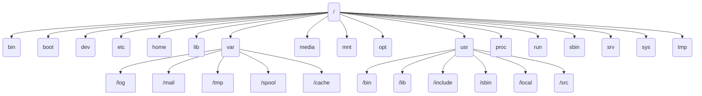

## 一、Linux简介与系统安装

### UNIX简介

**Unix起源**

- 在Windows， Macos，Linux等操作系统出现之前，Unix就已诞生
- 1971年，Unix操作系统诞生于AT&T公司的贝尔实验室Unix的出现源于贝尔实验室的两位软件工程师：
  - KenThompson（肯.汤姆森）
  - DennisRitchie（丹尼斯.里奇）：C语言之父

**Unix特点**

1. 简单性：Unix系统易学易用，基本命令简洁明了。
2. 开放性：Unix源代码公开，可以自由获取和修改。
3. 可移植性：Unix系统可以在不同的硬件平台上运行，并且软件应用程序的可移植性好。
4. 网络通信能力：Unix系统内置网络协议栈，支持网络通信。
5. 多用户支持：Unix系统支持多用户同时登录，每个用户都有自己的账户和权限控制。
6. 多任务支持：Unix系统支持多任务，可以同时运行多个进程。
7. 命令脚本支持：Unix系统支持命令脚本编程，可以通过脚本实现批量操作和自动化任务。

**Minix系统**

Minix（Minimal Unix）是一种简化版的Unix操作系统，由荷兰计算机科学家安德鲁·S·坦恩伯格（Andrew S. Tanenbaum）开发。Minix最初是作为教育用途而开发的，其目的是帮助学生更好地理解操作系统的原理和设计。与Unix类似，Minix也是一个分时多用户操作系统，但相比于Unix，Minix更加精简、可移植性更强，同时也更易于理解和修改。

需要注意的是，Minix并非直接基于Unix代码开发的，而是在其设计中借鉴了Unix的部分思想和设计原则。另外，Linus Torvalds在开发Linux之前，也曾在Minix上进行过学习和实践。

### Linux简介

**Linux诞生**

- Linux起源于芬兰人Linus Torvalds（林纳斯托沃兹）的个人爱好
- 1991年，大一新生Linus觉得Minix功能不足且不好用在研究Minix源码基础上，不断加入功能，逐渐开发
- Linux内核，然后开源出去，全世界的程序员一起完善
- Linux 没有包括Unix源代码，没有版权冲突
- Linux 是类Unix系统，完全兼容Unix
- Linux是按照公开的POSIX标准编写的

**POSIX规范**

- 应用接口的国际标准
- 一种可移植操作系统接口，定义了一套标准的操作系
- 统一接口和工具，最初是基于Unix制定的针对操作系统
- 为了获得不同操作系统在源代码级上的软件兼容性
- 使操作系统具有较强的可移植性

**Linux的定义**

- Linux是一种**自由、开放、免费**的系统软件，是一种**多任务**和**多用户**的网络操作系统。
- Linux  具有双重的含义。更严格地讲，““Linux 本身只表示Lix内核，但在实际中人们已经习惯了用“Linux”来形容Limux的各种发行版，把它们统称为Linux操作系统。

**Linux的内核版本**

内核版本号由三个部分的数字组成主版本号+次版本号+修订序列号

- 第一部分代表主版本号
- 第二部分是次版本号
- 第三部分是修订序列号

**Linux发行版**

- 开源特性导致有很多发行版
- Linux发行版是包含Linux内核的众多软件的集合
- 通常人们所说的“Linux操作系统”就是各种Linux发行版Linux的发行版搭配了各种人机界面、应用软件和服务软件

**Linux常见发行版**

- 服务器：
  - RHEL（Redhat企业版）
  - Centos（RHEL源码重新编译的社区免费版）
- 桌面版：
  - Ubuntu
  - Fedora
  - DeepinLinux（国产，基于Debian）
  - Kali（网络安全、网络攻防工具丰富）

**Linux特点**

*Linux的优点*

- 基于Unix设计，性能出色
- 遵循GPL许可，白由软件
- 符合POSIX标准，兼容性好
- 可移植性好
- 网络功能强大
- 设备独立性
- 安全性强
- 良好的用户界面

*Linux的缺点*

- Linux发行版本太多，不同版本的使用上还存在差异；
- 不同版本之间的兼容性不好；
- 入门要求较高；
- 中文支持不够好等缺点。

### Ubuntu简介

Ubuntu读音：[oo-boon-too]乌班图

- 以桌面应用为主的开源GNU/Linux操作系统
- 基于DebianGNU/Linux
- 为什么学习Ubuntu？
  - Ubuntu是最火的Linux发行版
  - 拥有非常强大成熟的社区，资源、教程、讨论都非常全面
  - Ubuntu是一个以桌面应用为主的Linux操作系统。

## 二、Linux系统接口管理

### 2.1 操作系统接口

Linux系统的接口

| 命令行用户接口（shell）          | 图形用户接口（windows）            | 程序接口（系统调用）                 |
| -------------------------------- | ---------------------------------- | ------------------------------------ |
| 以命令的方式使用系统的用户界面。 | 以鼠标驱动方式使用系统的用户界面。 | 提供一组系统调用命令供应用程序使用。 |

### 2.2 Shell命令接口

**Shell命令接口的组成**

- Shell接收用户输入的命令并把它送入内核去执行，向用户返回结果
- Linux下的Shell命令接口由一组命令和命令解释程序Shell组成。

**命令** 

完成用户需要的各种操作

1. 文件操作
2. 数据传输
3. 进程控制
4. 系统监控

**Shell**

- bsh: 最经典的Shell， 每种Linux、Unix都可用
- csh： 语法和C语言类似，交互性更好
- ksh： 集合bsh和csh的优点
- bash: bsh的扩展，同时结合了csh和ksh的优点
- tcsh: csh的扩展
-  pdksh: ksh的扩展

### 2.3 XWindow图形接口

**XWindow简述**

- XWindow是Linux的图形化用户接口。

- XWindow是一个图形接口系统的标准体系框架。

- 规定了构成图形界面的实现架构、软件以及运作协议

- Windows系统的图形界面是必选的

- Linux系统的图形界面（XWindow）是可选的

- 无图形界面称为字符界面或命令行界面（CL）

 **Window系统组成**

- XWindow系统的核心概念，是客户/服务器构架。 
- 主要的组成成分是XServer、xclient和XProtocol，即X服务器端、X客户端、X协议。
- 这种客户/服务器架构的主要特点在于，window系统中，应用程序的“运行”和“显示”是可分离的。

**XWindow与字符界面的切换**

Linux默认打开7个屏幕，编号为ttyitty7。
XWindow启动后，占用的是tty7，tty1～tty6仍为字符界面屏幕，用【Alt+Ctrl+Fn】组合键（n=1~7）即可实现字符界面与Window界面的快速切换。

### 2.4 GNOME桌面环境

- 1999年，墨西哥程序员Miguel开发了Linux下的桌面系统GNOME1.0版。
- GNOME是基于GPL的完全开放的软件，可以让用户很容易的使用和配置计算机。
- Ubuntu18.04LTS版本中，以GNOME3.28作为默认的桌面环境。

### 2.5 登录、注销、关机和重启

 **登录系统**

- Linux是一个多用户多任务的操作系统
- 用户必须通过用户名和密码的验证，才能进入系统
- 登录过程就是系统对用户身份的确认
- 每个Linux系统都有且仅有一个超级管理员，即root用户Ubuntu默认是以普通用户启动系统
- 保障系统安全性安装Ubuntu系统时，提示输入用户名和密码，创建的是普通用户此用户就是以后登录的默认用户

**登录方式**

- 桌面环境登录
- 字符界面登录
- 远程登录（字符界面）：sssh、Telnet等
- Linux包括多个控制台（登录界面）
- 控制台之间可以通过组合键来切换Ctrl+Alt+Fn（Fn的范围：F1~F12）
- 在一个物理控制台上虚拟了多达7个控制台，包括6个字符控制台和1个图形控制台。

**关机与重启系统**

- 常用关机命令是：Shutdown
- 常用重启命令是：reboot
- 这些命令都必须是root权限用户才可使用的

### 2.6 程序接口

系统调用在系统中的主要用途包括：

- 控制硬件
- 设置系统状态或读取内核数据
- 进程管理

在Linux中常用的系统调用按照功能逻辑大致可分为：
  1. 进程控制
  2. 文件系统控制
  3. 系统控制
  4. 存储管理
  5. 网络管理
  6. socket控制
  7. 用户管理
  8. 进程间通信

| 系统调用                                                     | 系统调用接口                                           | Linux中的系统调用                               |
| ------------------------------------------------------------ | ------------------------------------------------------ | ----------------------------------------------- |
| 由操作系统内核提供一系列内核函数，通过一组称为系统调用的接口提供给用户使用。 | 系统调用接口是由一系列的系统调用函数构成的“特殊”接口。 | Linux系统利用系统调用进行内核与用户空间通信的。 |

## 三、Linux文件系统

### 3.1 Ubuntu的文件系统

**文件系统简介**
定义：文件系统是操作系统用于明确磁盘或分区上的文件的方法和数据结构，即文件在磁盘上的组织方法。
操作系统中负责管理和存储文件信息的软件机构称为文件（管理）系统。

作用：负责为用户建立文件，存入、读出、修改、转储文件，控制文件的存取，当用户不再使用时撤销文件等
文件系统对应硬盘的一个分区，而不是整个硬盘不同的分区可以有不同的文件系统（使用了VFS）

文件系统由三部分组成：

- 与文件管理有关的软件
- 被管理的文件
- 实施文件管理所需数据结构。

**目录（文件夹）**

- 目录是文件系统维护所需的特殊文件
- 目录中为内部每个文件设立表目
- 目录没有扩展名，而是提供了指向对应空间的地址
- 目录大小（通常是4K）不等于目录内所有文件的大小

**建立文件系统**
大部分程序基于文件系统进行操作一个分区或磁盘在作为文件系统使用前，需要进行初始化（格式化），并将记录数据结构写到磁盘上这个过程就叫做建立文件系统

**Liux文件系统架构**

Linux文件系统

- 现代Linux内核几乎支持计算机系统中所有文件系统
- 从基本的FAT到高性能文件系统
- Linux操作系统从一开始就追求让用户使用多个文件系统

**Linux支持的文件系统**

1. ext4：是Linux系统下的日志文件系统，是ext3文件系统的后继版本
2. NFS：网络文件系统，由SUN发明，主要用于远程文件共享
3. MS-DOS：MS-DOS文件系统
4. FAT：WindowsXP操作系统采用的文件系统
5. NTFS：WindowsNT/XP操作系统采用的文件系统
6. HPFS：OS/2操作系统采用的文件系统
7. PROC： 虚拟的进程文件系统
8. IS09660：大部分光盘所采用的文件系统，挂载光盘时指定此文件系统
9. ufsSun：OS所采用的文件系统
10. NCPFS：Novell服务器所采用的文件系统
11. SMBFS：Samba的共享文件系统
12. XFS：由SGI开发的先进的日志文件系统，支持超大容量文件
13. JFS：IBM的AIX使用的日志文件系统
14. ReiserFS：基于平衡树结构的文件系统虚拟文件系统（VirtualFileSystem，VFS）

**Ext2文件系统**

Ext2文件系统和其它现代Unix使用的文件系统非常相似，但更接近于BSD系统所用的Berkeley Fast File system
Ext2文件系统的特点是存取文件的性能极好

- 其单一文件大小与文件系统本身的容量上限和文件系统本身的族大小有关。
- 在一般常见的×86计算机系统中簇最大为4KB
- 单一文件大小上限为2048GB （2T）

文件系统的容量上限为16384GB

ext4

- ext4是第四代扩展文件系统，是Linux系统下的文件系统
- 2008年12月25日，ext4文件系统随着Linux
- Kernel2.6.28的正式版本发布成为稳定发布版
- ext4的文件系统容量达到1EB
- 单个文件容量达到16TB

**Ubuntu的目录结构**

文件的路径名指的就是从某个目录开始，穿过整个文件系统，直至到达目标文件而经过的一条目录层次路径。/usr/bin/find

绝对路径：指文件的准确位置且以根目录为起点，例如“/usr/game/gnect
相对路径：相对于用户当前位置的一个文件或录的位置，如果用户现在处于“/usr”中，只需要“cgame/gnect”就可以确定这个文件而不需要将根目录写出

组织结构

- Windows每个盘符下都是一个树形分层结构，有若干根节点
- Linux是一个树形分层结构组织，只有一个根节点




| 目录名 | 描述                                     |
| ------ | ---------------------------------------- |
| /      | 根目录，整个文件系统的起始点             |
| /bin   | 存放二进制可执行文件                     |
| /boot  | 存放启动Linux时使用的必要文件            |
| /dev   | 存放设备文件                             |
| /etc   | 存放系统配置文件                         |
| /home  | 用户主目录                               |
| /lib   | 存放共享库文件                           |
| /media | 自动挂载的设备（如U盘、光驱等）的挂载点  |
| /mnt   | 手动挂载的设备的挂载点                   |
| /opt   | 第三方应用程序目录                       |
| /proc  | 虚拟文件系统，提供了内核和进程的信息     |
| /root  | 超级用户（root）的主目录                 |
| /run   | 存放系统运行时需要的临时文件             |
| /sbin  | 存放超级用户使用的系统管理程序           |
| /srv   | 存放服务相关文件                         |
| /sys   | 虚拟文件系统，提供了内核设备树的信息     |
| /tmp   | 存放临时文件                             |
| /usr   | 存放大部分用户安装的应用程序和文件       |
| /var   | 存放经常变化的文件，如日志文件和缓存文件 |

与Windows的差别

1. Linux中是严格区分大小写的
2. Linux系统中文件类型与后名没有直接关系

### 3.2 挂载与卸载文件系统

创建文件系统
两种方法创建文件系统：
 1、使用通用的mkfs命令，在选定的磁盘分区中创建指定文件系统；
 2、利用各种特定的工具，如mke2fs、mkfs.ext2或mkfs.vfat等，在选定的磁盘分区上直接创建特定类型的文件系统。

创建文件系统时，最基本的工具通常是mkfs命令
对于Ext2/Ext3文件系统，可使用mke2fs/mkfs.ex2/mkfs.ext2

**创建文件系统**
示例：
mkfs.ntfs /dev/sdb1
#将/dev/sdb1 格式化为ntfs格式mkfs-text4/dev/sdb2
#将/dev/sdb2分区格式化为ext4格式

**挂载文件系统**
对于一个文件系统或分区而言，如果想要使用，必须先对其进行挂载操作。
挂载”就是把新建的文件系统安装到Linux文件系统目录层次结构的某个安装点上。也就是说，挂载点必须是目录，可以将挂载看成是一个连接动作。


使用mount命令挂载
为什么有挂载？Windows有挂载吗？
linux只有一个根目录，新建分区要使用必须在根目录下创建一个目录指向这个分区，点击创建的目录实际是打开新的分区
windows分区超过26个的处理，也是创建文件夹快捷方式
26个盘符以内windows的做法是帮我们挂载（直接给个新的盘符）


mount命令示例：
#将分区sdb1  挂载到/mnt/myftproot:
sudo  mkdir   /mnt/myftproot
mount   /dev/sdb1   /mnt/myftprootdf-hT命令查看挂载是否成功，文件系统类型和大小


**盘分区挂载步骤**
第一步：创建硬盘分区
准备工作：为Ubuntu添加一块硬盘，大小5G1、

查询磁盘信息    --sudofdisk-l或Is -l/dev/sd*为磁盘分区       

-sudo fdisk /dev/sdb为磁盘分区，并指定分区类型盘分区挂载步骤

第二步：创建文件系统
格式化分区sudomkfs.ext4/dev/sdb1创建可用的文件系统

第三步：挂载文件系统
挂载分区，使分区可用--ssudo mount/dev/sdbi/mnt先在Linux系统上创建载入点，再将新分区载入

**卸载文件系统**
卸载文件系统意味着把文件系统从挂载点移走删除/etc/mtab文件中的挂载项。
在文件系统的管理与维护工作中，有些工作只能在未挂载的文件系统中执行，因此需要进行卸载文件系统操作。
当不再需要临时挂载的文件系统时，也应及时进行卸载操作，避免数据的误操作。

载文件系统的命令是umount
卸载文件系统/dev/sdb1，挂载在/mnt/myftproot
user@user-desktop:/udoumount/mnt/myfptroot
可以看到，文件系统已经被卸载。

查看/etc/mtab文件可以得到同样的结果。user@user-desktop:/ cat /etc/mtab

## 四、Linux常用命令

### 4.1 Linux 终端命令格式

一个命令行中可以输入多个命令，命令之间用分号分隔

Linux系统严格区分大小写

Linux 所有的目录和文件名都是大小写敏感的

终端命令格式：

```bash
command [-/--options] [parameter]
```

command：命令名，相应功能的英文单词或单词的缩写

[-options]：选项，可用来对命令进行控制，也可以省略（单字符选项用－，单词选项使用--）

parameter：传给命令的参数，可以是零个、一个或者多个

> []代表可选

**自动补全**

- 在敲出/**文件/目录/命令**的前几个字母之后，按下`tab`键
- 如果输入的没有歧义，系统会自动补全
- 如果还存在其他**文件/目录/命令**，再按一下`tab`键，系统会提示可能存在的命令
- 按**上/下**光标键可以在曾经使用过的命令之间来回切换
- 如果想要退出选择，并且不想执行当前选中的命令，可以按`ctrl+c`

重要热键
   Ctrl+C              中断前台执行程序
   Ctrl+D           离开当前shell
   上下方向键           翻出历史命令
   Tab：按一次         命令后自动补全命令，文件名后自动补全文件名
   Tab：按两次          出以输入开头的所有命令

### 4.2 目录操作基本命令

- 常用命令熟能生巧
- 学会常用命令，不常用可查询

| 命令          | 英文                    | 描述                       |
| ------------- | ----------------------- | -------------------------- |
| ls            | list                    | 查看当前文件夹下的内容     |
| tree [目录名] | tree                    | 以树状图列出文件目录结构   |
| cd            | change directory        | 更改当前工作目录           |
| pwd           | print working directory | 显示当前工作目录的绝对路径 |
| mkdir         | make directory          | 创建一个新目录             |
| rmdir         | remove directory        | 删除一个空目录             |

小技巧

- `ctrl + shift + =`**放大**终端窗口的字体显示
- `ctrl + -`**缩小**终端窗口的字体显示

**ls **

> 小知识：ls -al == ll (List Long)

**常用选项**

| 参数 | 含义                                                 |
| ---- | ---------------------------------------------------- |
| -a   | 显示指定目录下所有子目录与文件，包括隐藏文件         |
| -l   | 以列表方式显示文件的详细信息                         |
| -h   | 配合以人性化的方式显示文件大小                       |
| -t   | 按文件修改的时间排序显示                             |
| -s   | 显示每个文件的大小                                   |
| -S   | s（大写）按文件的大小排序                            |
| -F   | 显示文件类型描述符。*为可执行的普通文件，/为目录文件 |

**ls 通配符的使用**

| 通配符 | 含义                                 |
| ------ | ------------------------------------ |
| *      | 代表任意个数个字符                   |
| ?      | 代表任意一个字符，至少 1 个          |
| []     | 表示可以匹配字符组中的任一个         |
| [abc]  | 匹配 a、b、c 中的任意一个            |
| [a-f]  | 匹配从 a 到 f 范国内的的任意一个字符 |

#### tree

| 选项 | 含义       |
| ---- | ---------- |
| -d   | 只显示目录 |

#### cd

| 命令  | 含义                                     |
| ----- | ---------------------------------------- |
| cd    | 切换到当前用户的主目录（home/用户目录）  |
| cd ~  | 切换到当前用户的主目录（/home/用户目录） |
| cd /  | 切换到根目录                             |
| cd .  | 保持在当前目录不变                       |
| cd .. | 切换到上级目录                           |
| cd -  | 可以在最近两次工作目录之间来回切换       |

##### 相对路径和绝对路径

- 相对路径在输入路径时，最前面不是/或者～，表示相对**当前目录**所在的目录位置
- 绝对路径在输入路径时，最前面是/或者～，表示从**根目录/家目录**开始的具体目录位置

#### mkdir

> 新建目录的名称不能与当前目录中已有的目录或文件同名

| 选项    | 含义                                     |
| ------- | ---------------------------------------- |
| -p      | 一次性建立多级目录，即以递归形式建立目录 |
| -m 权限 | 新建目录设置存取权限，权限777。          |

#### rmdir

| 选项 | 含义             |
| ---- | ---------------- |
| -p   | 递归删除各级目录 |

### 4.3 文件操作基本命令

| 命令               | 英文        | 描述                                                         |
| ------------------ | ----------- | ------------------------------------------------------------ |
| touch              | touch       | 创建一个新的空白文件或更新现有文件的时间戳。                 |
| cat                | concatenate | 在终端显示一个或多个文件的内容。也可以用于连接文件并输出到新文件。 |
| cp 源文件 目标文件 | copy        | 从源位置复制一个或多个文件到指定目标位置。                   |
| rm                 | remove      | 永久删除一个或多个文件。                                     |
| mv 源文件 目标文件 | move        | 将文件从一个位置移动到另一个位置，也可以用于重命名文件。     |
| chmod              | change mode | 更改文件或目录的权限（读取、写入、执行）。                   |

#### touch

- 创建文件或修改文件时间
  - 如果文件**不存在**，可以创建一个空白文件
  - 如果文件**已经存在**，可以修改文件的未次修改日期

#### cat

> 小技巧：cat > 文件名 （新建文件）

- cat 命令可以用来**查看文件内容**、**创建文件**、**文件合并**、**追加文件内容**等功能
- cat 会一次显示所有的内容，适合**查看内容较少**的文本文件

| 选项 | 含义                                             |
| ---- | ------------------------------------------------ |
| -A   | 显示所有字符，包括换行符、制表符及其他非打印字符 |
| -s   | 连续的空行压缩为一个空行                         |
| -b   | 对非空输出行编号                                 |
| -n   | 对输出的所有行编号                               |

> Linux 中还有一个 nl 的命令和 cat-b 的效果等价

#### cp

> cp 命令的功能是将给出的文件或目录复制到另一个文件或目录中，相当于 DOS 下的 copy 命令

| 选项 | 含义                                                         |
| ---- | ------------------------------------------------------------ |
| -i   | 覆盖文件前提示                                               |
| -r   | 若给出的源文件是目录文件，则 cp 将递归复制该目录下的所有子目录和文件，目标文件必须为一个目录名 |

#### rm

> 使用 rm 命令要小心，因为文件删除后不能恢复
>
> rm -rf dirname #递归删除非空目录（慎用）

| 选项 | 含义                                             |
| ---- | ------------------------------------------------ |
| -i   | 询删除，避免误删                                 |
| -v   | 显示文件的删除进度                               |
| -f   | 强制删除，忽略不存在的文件，无需提示             |
| -r   | 递归地删除目录下的内容，删除文件夹时必须加此参数 |

#### mv

> 命令可以用来移动文件或目录，也可以给文件或目录重命名

| 选项 | 含义           |
| ---- | -------------- |
| -i   | 覆盖文件前提示 |

#### chmod

> Linux一个非常重要的命令，它的执行可以修改文件的权限和文件的属性。

命令格式如下：

`chmod [<文件使用者>+/-/=<权限类型>]文件名1文件名2`

| 文件使用者 | 英文   | 描述                     |
| ---------- | ------ | ------------------------ |
| u          | user   | 文件或目录所有者         |
| g          | group  | 文件所有者所在群组的用户 |
| o          | others | 其他用户                 |
| a          | all    | 所有用户                 |

| 操作符号 | 描述                           |
| -------- | ------------------------------ |
| +        | 增加权限                       |
| -        | 删除权限                       |
| =        | 赋予指定权限，并取消本来的权限 |

| 权限类型 | 权限                | 数字 | 对文件操作         | 对目录操作                 |
| -------- | ------------------- | ---- | ------------------ | -------------------------- |
| r        | 只读（read）权限    | 4    | 可以读取文件的内容 | 可以列出目录中的文件       |
| w        | 写（write）权限     | 2    | 可以修改、删除文件 | 可以在目录中创建、删除文件 |
| x        | 执行（execute）权限 | 1    | 可以执行文件       | 可以使用cd命令进入此目录   |

其他：

| 命令                | 英文         | 描述               |
| ------------------- | ------------ | ------------------ |
| chown 用户名 文件名 | change own   | 更改文件所有者     |
| chgrp 用户组 文件名 | change group | 更改所有者的所在组 |

### 4.4 文件处理命令

| 命令    | 英文       | 描述                                               |
| ------- | ---------- | -------------------------------------------------- |
| echo    | echo       | 打印一行文本或变量的值                             |
| grep    | grep       | 在文件中搜索匹配的字符串                           |
| head    | head       | 查看文件的前几行                                   |
| tail    | tail       | 查看文件的后几行                                   |
| wc      | word count | 统计文件中的行数、单词数和字符数                   |
| sort    | sort       | 对文件进行排序                                     |
| find    | find       | 在指定目录下查找文件或目录                         |
| which   | which      | 查找并显示给定命令的路径                           |
| whereis | where is   | 显示指定命令的二进制文件、源代码文件和帮助文件路径 |
| locate  | locate     | 通过文件名快速查找文件，使用内部数据库提高查找速度 |

#### echo

echo 文字内容

- `echo`会在终端中显示参数指定的文字，通常会和**重定向**可联合使用

**重定向>和>>**

- Linux 允许将命令执行结果**重定向**到一个文件
- 将本应显示在**终端上的内容** **输出/追加**到**指定文件中**

其中

- `>` 表示输出，会覆盖文件原有的内容
- `>>`表示追加，会将内容追加到已有文件的未尾

**管道 l**

- Linux 允许将一个命令的输出可以通过管道做为另一个命令的输入
- 可以理解现实生活中的管子，管子的一头塞东西进去，另一头取出来，这里的左右分为两端，左端塞东西（写），右端取东西（读）

常用的管道命令有：

- `more`：分屏显示内容
- `grep`：在命令执行结果的基础上查询指定的文本

#### grep

- Linux 系统中`grep`命令是一种强大的文本搜索工具
- grep 允许对文本文件进行**模式**查找，所谓模式查找，又被称为正则表达式

| 选项 | 含义                                     |
| ---- | ---------------------------------------- |
| -n   | 显示匹配行及行号                         |
| -v   | 显示不包含匹配文本的所有行（相当于求反） |
| -i   | 忽略大小写                               |

- 常用的两种模式查找

| 参数 | 含义                     |
| ---- | ------------------------ |
| ^a   | 行首，搜寻以 a 开头的行  |
| ke$  | 行尾，搜导以 ke 结束的行 |

#### head/tail

> 查看文件的开头/结尾部分内容，默认10行

| 选项           | 含义                                          |
| -------------- | --------------------------------------------- |
| -n             | 想显示的行号                                  |
| -f（tail独占） | 实时监控文件变化，一般用于监控系统log日志文件 |

#### wc

| 选项 | 含义       |
| ---- | ---------- |
| -l   | 显示行数   |
| -w   | 显示单词数 |
| -m   | 显示字符数 |

#### sort

> 对文件内容或查询结果排序并输出，默认升序排序

| 选项   | 含义                           |
| ------ | ------------------------------ |
| -u     | 去重复行                       |
| -r     | 降序排序                       |
| -t，-k | -t 设定间隔符，-k 指定列数排序 |

#### find

> 查找文件或目录，默认在本目录下，-name指定字符串查找文件或目录
>
> 小知识：
>
> **locate** 是find -name的另一种写法但是要比find命令快得多

| 命令                     | 作用                                         |
| ------------------------ | -------------------------------------------- |
| find [路径] -name “*.py” | 直找指定路径下扩展名是.py 的文件，包括子目录 |

- 如果省略路径，表示在当前文件夹下查找
- 之前学习的通配符，在使用`find`命令时同时可用

#### which/whereis

| 命令    | 描述                                   | 对比         |
| ------- | -------------------------------------- | ------------ |
| which   | 查询命令的位置（绝对路径）             | 无           |
| whereis | 查询命令的位置以及包含文件名的所有文件 | 说明文档位置 |

#### locate

>  查询新建文件，必须使用updatedb，使用locate去查找自己想要的东西，速度比find快
>
>  updatedb：更新locate查找信息的系统数据库的命令。

### 4.5 压缩备份基本命令

**打包**

- 打包压缩是日常工作中备份文件的一种方式
- 在不同操作系统中，常用的打包压缩方式是不同的
  - `Windos`常用`rar`
  - `Mac`常用`zip`
  - `Linux`常用`tar.gz`

**打包/解包**

- tar 是 Linux 中最常用的备份工具，此命令可以把一系列文件打包到一个大文件中，也可以把一个打包的大文件恢复成一系列文件

| 命令            | 英文           | 描述                                             |
| --------------- | -------------- | ------------------------------------------------ |
| tar             | tape archive   | 用于创建、查看和提取tar存档文件                  |
| zip             | zip            | 用于将文件压缩成zip格式的归档文件                |
| unzip           | unzip          | 用于解压缩zip格式的归档文件                      |
| gzip            | GNU zip        | 用于压缩文件并生成.gz格式的压缩文件              |
| bzip2           | bzip2          | 用于压缩文件并生成.bz2格式的压缩文件             |
| bunzip2         | bzip2          | 用于解压缩.bz2格式的压缩文件                     |
| zcat            | gzip catenate  | 用于查看.gz格式的压缩文件的内容                  |
| bzcat           | bzip2 catenate | 用于查看.bz2格式的压缩文件的内容                 |
| tar.gz（后缀）  | tar and gzip   | 用于将多个文件或目录压缩成.tar.gz格式的压缩文件  |
| tar.bz2（后缀） | tar and bzip2  | 用于将多个文件或目录压缩成.tar.bz2格式的压缩文件 |

#### tar

> 注意：tar本身不具有压缩功能
>
> 打包是将文件或目录打成一个包（大文件夹），tar包文件的大小等于这些文件和目录的大小总和
>
> 注意：`f`选项必须放在最后，其他选项顺序可以随意

| 选项        | 含义                               |
| ----------- | ---------------------------------- |
| -c          | 创建一个新的归档文件               |
| -x          | 从归档文件中提取文件               |
| -f          | 指定要操作的归档文件               |
| -v          | 显示归档过程中处理的文件列表       |
| -t          | 列出归档文件中包含的文件列表       |
| -z          | 对归档文件进行 gzip 压缩           |
| -j          | 对归档文件进行 bzip2 压缩          |
| -r          | 向归档文件中添加文件               |
| --delete    | 从归档文件中删除文件               |
| --add-file  | 向归档文件中添加单个文件           |
| --wildcards | 使用通配符向归档文件中添加多个文件 |

| 常用选项         | 含义                                               |
| ---------------- | -------------------------------------------------- |
| -cf （打包）     | 打包成后缀为.tar的新文件                           |
| -tf              | 查看filename.tar打包文件里的内容                   |
| -xf （解包）     | 抽取filename.tar打包文件里的内容，原文件不会消失。 |
| -czvf            | 将文件打包并用gzip压缩                             |
| -cjvf            | 将文件打包并用bzip2压缩                            |
| -xzvf            | 将tar.gz文件解包并解缩                             |
| -xjvf            | 将tar.bz2文件解包并解缩                            |
| -xzvf 包 -C 路径 | 将tar.gz文件解包并解缩到指定目录                   |

#### zip/unzip

> 压缩或解压缩文件、目录

优点：

- 兼容不同的操作系统，比如Linux，Windows及MacOS
- 可以用zip格式压缩那些需要共享给windows用户的文件

缺点：

- 压缩率不是很高

| 选项 | 含义             |
| ---- | ---------------- |
| -d   | 解压到指定目录   |
| -n   | 不覆盖原来的文件 |
| -v   | 查看压缩包内容   |

#### gzip

> Linux中常用的压缩解压命令，推荐的压缩格式

| 选项 | 含义                    |
| ---- | ----------------------- |
| -d   | 解压                    |
| -n   | 指定压缩级别，范围是1-9 |

#### bzip2/bunzip2

> 一对压缩和解压命令
>
> 注意：在利用bzip2进行文件的压缩后，压缩前的原始文件消失，系统会生成一个新的压缩文件，文件名的后缀为.bz2。另外，利用bzip2压缩后的压缩文件必须利用bunzip2命令才能实现解压，恢复为原始文件。

#### zcat/bzcat

> 查看压缩文件内容
>
> 不同：
>
> - zcat针对.gz后缀的压缩文件进行查看。
> - bzcat针对.bz2后缀的压缩文件进行查看。

#### 总结

1. `*.tar`用tar -xvf解压
2. `*.gz`用gzip -d或者gunzip解压
3. `*.tar.gz`和`*.tgz`用tar -xzf解压
4. `*.bz2`用bzip2 -d或者用bunzip2解压
5. `*.tar.bz2`用tar -xjf解压
6. `*.Z`用uncompress解压
7. `*.tar.Z`用tar -xZf解压
8. `*.rar`用unrar e解压
9. `*.zip`用unzip解压

### 4.6 磁盘操作命令

磁盘分区

- Windows、Linu×下有主分区、扩展分区和逻辑分区的

概念：

- 主分区
  - 一个磁盘的主分区至少1个，最多3．4个
- 扩展分区
  - 扩展分区的数量为0一1个，扩展分区不能直接使用，需要划分逻辑分区后才能使用
- 逻辑分区
  - 必须基于扩展分区创建，数量没有限制

注意：主分区+扩展分区<=4

linux的分区及编号

sda1

sd：SATA或者SCSI类型的硬盘

a：硬盘名称，a表示第一块硬盘，以此类推

1：分区编号，1表示第一个分区，以此类推

| 命令   | 英文              | 描述                                        |
| ------ | ----------------- | ------------------------------------------- |
| mount  | mount             | 用于将文件系统挂载到Linux文件树中的指定位置 |
| umount | unmount           | 用于卸载已经挂载的文件系统                  |
| df     | disk free         | 用于显示磁盘空间使用情况                    |
| du     | disk usage        | 用于显示目录或文件所占用的磁盘空间大小      |
| fsck   | file system check | 用于在启动时检查和修复文件系统错误          |

#### mount

> 挂载设备（硬盘分区，光盘，U盘，移动硬盘等）到系统
>
> 注意：需要先创建挂载点才能挂载

命令格式：

mount [-t 文件系统] [-o 选项] 设备 挂载点（目录）

| 选项 | 含义               |
| ---- | ------------------ |
| -t   | 指定文件系统的类型 |
| -o   | 描述设备挂载方式   |
| -a   | 挂载所有设备       |

#### unmount

> 卸载已经挂载的文件系统

#### df

| 选项 | 含义                                               |
| ---- | -------------------------------------------------- |
| -a   | 包含全部的文件系统                                 |
| -h   | 把各分区的大小和挂载的分区的大小以MB或GB的单位显示 |
| -T   | 显示文件系统的类型                                 |

#### fsck

> 硬盘检测，注意：该命令只能root用户执行

### 4.7 关机重启命令

| 命令     | 英文           | 描述                                         |
| -------- | -------------- | -------------------------------------------- |
| shutdown | shutdown       | 用于安全地关闭系统并提供定时或立即关闭的选项 |
| halt     | halt           | 用于关闭系统并停止所有进程                   |
| poweroff | power off      | 用于关闭系统并断电(直接使用)                 |
| reboot   | reboot         | 用于重新启动系统(直接使用)                   |
| init     | initialization | 用于切换系统运行级别和启动或停止指定服务     |

#### shutdown 

> shutdown 命令可以安全关闭或者重新启动系统
>
> 注意：root用户，才可用此命令

| 选项 | 含义                     |
| ---- | ------------------------ |
| -r   | 系统服务停掉然后安全重启 |
| -h   | 系统服务停掉然后安全关机 |

1. 不指定选项和参数，默认表示 1 分钟之后关闭电脑
2. 远程维护服务器时，最好不要关闭系统，而应该重新启动系统

常用命令示例

```bash
#重新启动操作系统，其中now表示现在
$ shutdown -r now
#立刻关机，其中now表示现在
shutdon now
#系统在今天的20:25会关机
$ shutdon 20:25
#系统再过十分钟后自动关机
$ shutdown +1
#取消之前指定的关机计划
$shutdown -C
```

#### hait

> 小知识：hait = shutdown -h
>
> hait -h 强行关机

#### init

> 切换Ubuntu的运行级别
>
> 说明：init命令中的“运行级别”一共有7级，    分别是从0-6。

| 运行级别 | 描述                                          |
| -------- | --------------------------------------------- |
| 0        | 停机或者关机（干万不能将initdefaulti设置为0） |
| 1        | 单用户模式，只root用户进行维护                |
| 2        | 多用户模式，不能使用NFS(Net File System)      |
| 3        | 完全多用户模式（标准的运行级别）              |
| 4        | 安全模式                                      |
| 5        | 图形化（即图形界面）                          |
| 6        | 重启（干万不要把initdefault设置为6）          |

### 4.8 其它常用命令

| 命令    | 英文     | 描述                                        |
| ------- | -------- | ------------------------------------------- |
| more    | more     | 用于显示文件内容，一页一页地显示            |
| less    | less     | 用于显示文件内容，可以向前或向后翻页        |
| help    | help     | 用于显示bash shell内置命令的帮助信息        |
| man     | manual   | 用于显示Linux系统中安装的大部分命令的手册页 |
| cal     | calendar | 用于显示日历                                |
| date    | date     | 用于显示或设置系统的日期和时间              |
| file    | file     | 查看文件属性                                |
| history | history  | 查看执行过的命令                            |
| ln      | link     | 软硬链接                                    |

#### more/less

- `more` 命令可以用于分屏显示文件内容，每次只显示一页内容
- 简单地浏览一个较小的文本文件，并且只需要向下滚动，可以使用 `more` 命令
- `less` 命令则支持向上和向下滚动文本
- 需要查看较大的文本文件，并且需要进行更多的交互和操作，建议使用 `less` 命令

| 操作键   | 功能                 |
| -------- | -------------------- |
| 空格键   | 显示手册页的下一屏   |
| Enter 键 | 一次滚动手册页的一行 |
| b        | 回滚一屏             |
| f        | 前滚一屏             |
| q        | 退出                 |
| /word    | 搜索 word 字符串     |

#### help/man

`-help`

```bash
	command --help
	显示command命令的帮助信息
```

`man`

```bash
	man command
	查阅command命令的使用手册
```

> man 是 manual 的缩写，是 Linux 提供的一个手册，包含绝大部分命令、函数的详细使用说明

使用 man 时的操作键：

| 操作键   | 功能                 |
| -------- | -------------------- |
| 空格键   | 显示手册页的下一屏   |
| Enter 键 | 一次滚动手册页的一行 |
| b        | 回滚一屏             |
| f        | 前滚一屏             |
| q        | 退出                 |
| /word    | 搜索 word 字符串     |

#### cal/date

`cal`显示日历

命令格式：cal [选项 [月份[年份]]]

| 选项 | 含义                                   |
| ---- | -------------------------------------- |
| -m   | 显示1-12月日历                         |
| -j   | 以凯撒历显示，即以一月一日起的天数显示 |
| -y   | 显示今年年历                           |

`date`显示及修改系统的日期和时间

> 注意：要修改系统时间，要取得root权限。

#### ln

| 命令                       | 作用             |
| -------------------------- | ---------------- |
| In 被链接的源文件 链接文件 | 建立文件的软链接 |

注意：

- 有`s`选项建立的是一个**软链接文件**
- **源文件要使用绝对路径**，不能使用相对路径，这样可以方便移动链接文件后，仍然能够正常使用

**软/硬链接简介（了解）**

- 软链接类似于 Windows 下的快捷方式

- 在使用`ln`创建链接时，如果没有`s`选项，会创建一个硬链接，而不是软链接
- 两个文件占用相同大小的硬盘空间，工作中几乎不会建立文件的硬链接

**文件软硬链接的示意图**

> 在 Linux 中，文件名和文件的数据是分开存储的


提示：

- 在`Linux`中，只有文件的`硬链接数 == 0`才会被删除
- 使用`ls-l`可以查看一个文件的硬链接的数量
- 在日常工作中，几乎不会建立文件的硬链接

#### $(普通用户)与#(超级用户)之间的切换

- 默认登录的是普通用户权限，显示$符

- 超级用户权限，显示#符

- 从普通用户切换超级用户权限：sudo su

- 从超级用户切换普通用户：su 用户名。

## 五、Linux常用应用软件

## 六、进程管理与系统监控

### 6.1 进程信息

进程：通俗地说就是当前正在执行的一个程序

| 命令               | 对应英文       | 作用                                |
| ------------------ | -------------- | ----------------------------------- |
| ps                 | process status | 查看进程的详细状况                  |
| jobs               |                | 查看系统中运行的任务                |
| nice               |                | 改变进程优先级                      |
| renice             |                | 进程执行时改变NI的值                |
| top                | top            | 动态显示运行中的进程并且排序        |
| kill [-9] 进程代号 | kill           | 终止指定代号的进程，-9 表示强行终止 |

#### ps

> ps 默认只会显示当前用户通过终端启动的应用程序

| 选项 | 含义                   |
| ---- | ---------------------- |
| -a   | 列出所有信息           |
| -X   | 显示没有控制终端的进程 |
| -u   | 查看特定用户进程       |
| -e   | 显示所有进程           |
| -f   | 全格式                 |

#### jobs

| 选项 | 含义                       |
| ---- | -------------------------- |
| -l   | 同时显示作业的PID          |
| -r   | 仅列出后台运行(run)的作业  |
| -s   | 仅列出后台暂停(stop)的作业 |

#### nice

选项：常用的一个选项是“-n”，n值即为NI的值，n值的范围为-20一19。

n值越小优先级越高。即，-20代表最高的NI优先级，19代表最低的NI优先级。

不加选项，默认NI值为10。

> 说明：只有root用户才能提高请求进程的优先级，普通用户只能降低请求进程的优先级。

#### renice

格式：renice [+/-n] [-g命令名...] [-p进程标识码..]［-u进程所有者...]

> 说明：可以通过命令名、进程标识码、进程所有者名指定要改变的进程的NI值

#### kill

| 选项 | 含义                                                |
| ---- | --------------------------------------------------- |
| pid  | 要中止进程的ID号                                    |
| -n   | 表示信号，一般用9和15                               |
| -9   | 无条件终止某个进程                                  |
| -15  | 先让进程善后（关闭socket链接，清理临时文件等)再结束 |

#### top

- 动态香看进程的变化
- top是一个动态显示过程，即可以通过用户按键来不断刷新当前状态
- top命令提供了实时的对系统处理器的状态监视
- top命令可以按CPU使用、内存使用和执行时间对任务进行排序

提示：

- 使用`kill`命令时，最好只终止由当前用户开启的进程，而不要终止`root`身份开启的进程，否则可能导致系统崩溃
- 要退出`top`可以直接输入`q`

### 6.2 进程管理

**进程管理**

- 进程是可并发执行的具有一定功能的程序段在给定数据集上的一次执行过程。
- 简而言之，进程就是程序的一次运行过程。
- 进程和程序的概念既相互联系文相互区别

**进程的特征**

- 并发性
- 独立性
- 动态性
- 异步性
- 结构性

图1

**进程控制块的作用**

1. 进程控制块的作用

- 为了描述和控制进程的运行，系统为每个进程定义了一个数据结构，该数据结构被称为进程控制块PCB
- PCB是进程存在的唯一标志。

2. 进程控制块中的内容
   - 进程标识符
   - 现行状态
   - 现场保留区
   - 程序与数据地址
   - 互斥与同步机构
   - 进程通信机构
   - 进程优先数
   - 资源清单
   - 家族联系
   - 链接字

**进程启动**

- 启动进程的过程即启动程序或者命令的过程
  启动进程的方式有两种：
  1. 前台启动方式
  2. 后台启动方式

1、前台方式启动进程

打开系统终端，在终端窗口的命令行提示符后输入命令并按回车键，就以前台方式启动了一个进程
示例：$ vi test
使用ps命令查看该进程的有关信息


2、后台方式启动进程

- 终端下以后台方式启动进程
- 要在执行的命令后面添加“&”


**进程处理**

| 命令                         | 对应英文 | 作用                     |
| ---------------------------- | -------- | ------------------------ |
| who                          | who      | 查看系统当前的在线用户   |
| last                         |          | 查看曾经登陆过系统的用户 |
| free                         | free     | 内存性能的监视           |
| -s：指定时间间隔进行持续监视 |          |                          |

1、改变进程的优先级

- 系统在为进程分配CPU等资源时，是通过优先级来进行判断的。

- 输入“PS-I”查看当前用故进程的优先级


2、挂起和激活进程

- 挂起当前正在运行的前台进程：
- Ctl+z
- 激活被挂起的进程有两种方式：
- fg命令：使被挂起的进程返回至前台运行
- bg命令：激活被挂起的进程，使之在后台运行
  - 选项：%命令序号


 3、结束进程

- 当某个进程已经僵死或者占用了大量CPU时间，就需要将该进程终止或者撤销该进程
- 终止前台进程：Ctl+c
- 终止后台作业(backgroundjob)
  1. 用fg命令把该作业转换为前台作业，然后使用 Ctrl+c
  2. 使用kill命令，关掉进程

**系统日志**

- 日志文件（LogFiles）
- 用于记录系统操作事件的记录文件或文件集合。
- 系统日志文件是包含关于系统消息的文件，包括内核、服务、在系统上运行的应用程序等。不同的日志文件记载不同的信息。
- 日志文件所处的位置都在/var/log目录下，通过ls命令可以查看该目录下的详细日志文件都有哪些。
- 用户可以使用文本编辑器打开并查看某个日志文件内容。


**系统服务**

- 系统服务是一种应用程序类型，它在后台运行
- 与运行程序相比，服务不会出现程序窗口或对话租
- 服务应用程序通常可以在本地和通过网络为用户提供一些功能
- 例如客户端/服务器应用程序、Web服务器、数据库服务器以及其他基于服务器的应用程序

**systemd命令**

- 列出正在运行的服务状态：systemctl
- 服务启动/停止/重启/状态：systemctl start/stop/restart/status服务名称
- 允许/禁止服务开机启动：systemctlenable/disable服务名称
- 查看服务是否开机启动：systemctlis-enabled服务名称
- 查看已启动的服务列表：systemctl list-unit-files
- 查看已启动的某个服务：systemctl list-unit-filesgrep服务名称

## 七、管理维护Linux系统

### 7.1 用户权限相关命令

#### 用户和权限的基本概念

**基本概念**

- **用户**是 Linux 系统工作中重要的一环，用户管理包括**用户**与**组**管理
- 在 Linux 系统中，不论是由本机或是远程登录系统，每个系统都**必须拥有一个账号**，并且**对于不同的系统资源拥有不同的使用权限**
- 在 Linux 中，可以指定每一个用户针对不同的文件或者目录的不同权限

对文件/目录的权限包括：

| 权限 | 英文   | 缩写 | 数字代号 |
| ---- | ------ | ---- | -------- |
| 读   | read   | r    | 4        |
| 写   | write  | w    | 2        |
| 执行 | excute | x    | 1        |

**组**

- Linux 为了方便用户管理，提出了组的概念，例如，几个用户为一组
- 在实际应用中，可以预先针对组设置好权限，然后将不同的用户添加到对应的组中，从而不用依次为每一个用户设置权限

**ls -l（扩展）**

ls-l 可以查看文件夹下文件的详细信息：

- **权限**：第 1 个字符如果是`d`表示目录
- 硬链接数：通俗地讲，就是有多少种方式，可以访问到当前目录/文件
- 拥有者：家目录下文件目录的拥有者通常都是当前用户
- 组
- 时间
- 名称


**chmod 简单使用 （重要）**

`chmod`可以修改**用户**/**组对文件**/**目录**的权限

> 提示：以下方式会一次性修改拥有者／组权限

命令格式如下：

```bash
chmod +/rwx 文件名|目录名
```

#### 超级用户

- Linux 系统中的`root`账号通常用于**系统的维护和管理**，对操作系统的所有资源**具有所有访问权限**
- 在大多数版本的 Linux 中，都不推荐**直接使用 root 账号登录系统**
- 在 Linux 安装的过程中，系统会自动创建一个用户账号，而这个默认的用户就称为“标准用户“

#### sudo

- `su`是 `substitute user`的缩写，表示**使用另一个用户的身份**
- `sudo`命令用来以其他身份来执行命令，预设的身份为`root`
- 用户使用`sudo`时，必须先输入密码，之后有**5 分钟的有效期限**，超过期限则必须重新输入密码

> 若其未经授权的用户企图使用 sudo，则会发出警告邮件给管理员

**sudo**

【功能】sudo命令的含义就是super do
指以超级管理员的身份执行某种操作
【格式】sudo 命令

**passwd**

功能：修改用户密码
【格式】passwd 用户名
【说明】该操作只充许root用户执行

**su**

【功能】转换用户
【格式】su 用户名

sudo和su

- 使用环境：由于su对切换到超级权限用户root后，权限无限制：所以su并不能担任多个管理员所管理的系统
- sudo可以针对每个管理员的技术特长和管理范围有针对性的下放权限，并且约定其使用哪些工具来完成与其相关的工作
- sudo相对于权限无限制性的su，对系统比较安全

#### 组管理终端命令

提示：

- **创建组/删除组**的终端命令都需要通过`sudo`执行
- 组信息保存在`/etc/group`文件中
- `/etc` 目录是专门用来保存**系统配置信息**的目录

| 命令                      | 作用                      |
| ------------------------- | ------------------------- |
| groupadd 组名             | 添加组                    |
| groupdel 组名             | 删除组                    |
| cat/etc/group             | 确认组信息                |
| chgrp -R 组名 文件/目录名 | 递归修改文件/目录的所属组 |

#### 用户管理终端命令

> 提示：创建用户/删除用户/修改其他用户密码的终端命令都需要通过 sudo 执行

**创建用户/设置密码/删除用户**

| 命令                        | 作用         | 说明                                                         |
| --------------------------- | ------------ | ------------------------------------------------------------ |
| useradd -m -g 组 新建用户名 | 添加新用户   | -m 自动建立用户家目录-g 指定用户所在的组否则会建立一个和同名的组 |
| passwd 用户名               | 设置用户密码 | 如果是普通用户直接用 passwd 可以修改自己的账户密码           |
| userdel -r 用户名           | 删除用户     | -r 选项会自动删除用户家目录                                  |
| cat/etc/passwd/             | grep 用户名  | 确认用户信息新建用户后，用户信息会保存在/etc/passwd 文件中   |

提示：

- 创建用户时，如果忘记添加`m`选项指定新用户的家目录，最简单的方法就是**删除用户，重新创建**
- 创建用户时，默认会创建一个和**用户名**同名的**组名**
- 用户信息保存在 `/etc/passd`文件中

**查看用户信息**

| 命令        | 作用                       |
| ----------- | -------------------------- |
| id [用户名] | 查看用户 UID 和 GID 信息   |
| who         | 查看当前所有登录的用户列表 |
| whoami      | 查看当前登录用户的账户名   |

**passwd 文件**

`/etc/passwd`文件存放的是用户的信息，由 6 个分号组成的 7 个信息

1. 用户名
2. 密码（x，表示加密的密码）
3. UID（用户标识）
4. GID（组标识）
5. 用户全名或本地帐号
6. 家目录
7. 登录使用的 Shell，就是登录之后 使用的终端命令， `ubuntu` 默认是`dash`

**usermod**

- `usermod`可以用来设置**用户**的**主组／附加组**和**登录`Shell`**，命令格式如下：
- **主组**：通常在新建用户时指定，在 etc/passwd 的第 4 列 GID 对应的组
- **附加组**：在`etc/group`中最后一列表示该组的用户列表，用于指定**用户的附加权限**

> 提示：设置了用户的附加组之后，需要重新登录才能生效

常用命令

```bash
#修改用户的主组（passwd中的GID）
usermod -g 组 用户名

#修改用户的附加组
usermod -G 组 用户名

#修改用户登录Shel1
usermod -s /bin/bash 用户名
```

> 注意：默认使用 useradd 添加的用户是没有权限使用 sudo 以 root 身份执行命令的，可以使用以下命令，将用户添加到 sudo 附加组中

```bash
usermod -Gs sudo 用户名

```

#### which （重要）

```bash
`which`命令可以查看执行命令所在位置
```

提示：

- `/etc/passwd`是用于保存用户信息的文件
- `/usr/bin/passwd`是用于修改用户密码的程序

常用命令

```bash
#输出
#/bin/ls
which ls

#输出
#/usr/sbin/useradd
which useradd
```

`bin`和`sbin`

- 在`Linux`中，绝大多数可执行文件都是保存在`/bin`、 `/sbin`、 `/usr/bin` `usr/sbin`
- `/bin`（`binary`）是二进制执行文件目录，主要用于具体应用
- `/sbin` （`system binary`）是系统管理员专用的二进制代码存放目录，主要用于系统管理
- `/usr/bin` （`user commands for applications`）后期安装的一些软件
- `/usr/sbin` （ `super user commands for applications`）超级用户的一些管理程序

切换用户

| 命令      | 作用                   | 说明                                   |
| --------- | ---------------------- | -------------------------------------- |
| su-用户名 | 切换用户，并且切换目录 | 可以切换到用户家目录，否则保持位置不变 |
| exit      | 退出当前登录账户       |                                        |

> su 不接用户名，可以切换到 root，但是不推荐使用，因为不安全
>
>
> `exit`会退出当前登陆的用户，返回原来登陆的用户，如果当前登陆的用户是本用户，则退出 Shell

修改文件权限

| 命令  | 作用       |
| ----- | ---------- |
| chown | 修改拥有者 |
| chgrp | 修改组     |
| chmod | 修改权限   |

命令格式

```bash
#修改文件|目录的拥有者
chown 用户名 文件名|目录名

#递归修改文件|目录的组
chgrp -R 组名 文件名|目录名

#递归修改文件权限
chmod -R 755 文件名|目录名

```

> chmod 在设置权限时，可以简单地使用三个数字分别对应拥有者/组和其他用户的权限

```bash
#直接修改文件|目录的读|写|执行权限，但是不能精确到拥有者|组|其他
chmod +/-rwx 文件名|目录名

```

- 常见数字组合有（`u`表示用户/`g`表示组/`o`表示其他）
- 777 u=rwx，g=rwx，o=rwx
- 755 u=rwx，g=rx，o=rx
- 644 u=rw，g=r，o=r

### 7.2 用户管理

#### 用户与组简介

- Linux系统是一个多用户、多任务的分时操作系统
- 用户需要向系统管理员申请一个账号才能使用系统
- 每个用户账号都拥有一个唯一的用户名和各自的口令（密码）
- 每个用户都具有一个唯一的身份标识，这个身份标识，称作用户ID（简称UID）

7.1.2用户种类

- 超级用户（root）
- 管理用户
- 普通用户

图

**Root账户**

- 超级用户（root)是一个特殊的用户
- 每个用户都有一个UID方便系统识别，root的UID为0
- root拥有最高权限，不受权限的限制，可以操作任何程序和文件
- 在Ubuntu中，默认root是被锁住的

**UID/GID**

- Linux系统不认识“账号”，Linux系统靠ID识别用户
- 用户ID是：UID
- 用户组ID是：GID
- ID是一个数字，账号是为了让使用者记忆方便
- root账户，UID为0
- 系统内建账号，UID在1-999之间
- 新建用户，默认UID>1000
- UID与账号的对应关系位于：/etc/passwd

**与用户管理相关的文件**

#用户的配置文件；/etc/passwd

- 包含所有用户的基本信息，所有用户都可以读取此文件
- 每个用户信息占一行
- 登陆Ubuntu系统时，输入用户名和密码之后
- 系统将会根据用户提供的用户名检查/etc/passwd文件
- 判断用户是否存在

**/etc/passwd**

数据保存格式：
username : passwd: uid : gid : comment : home : loginshell
数据保存格式字段详解：
1.用户名
2.密码（已经加密）
3.UID（用户标识），操作系统自已用的
4.GID组标识
5.用户全名或本地帐号
6.开始目录
7.登录使用的Shell，就是对登录命令进行解析的工具

#用户影子口令文件；/etc/shadow

- 影子密码文件，因passwd文件对所有人可读，为安全创建此文件
- 此文件用于存放系统内用户加密后的密码和用户登录控制信息
- 普通用户无法读取该文件，只有root用户才能读取该文件

数据保存格式：
username : passwd : lastchanged : minimum : maximum : alert : 字段7 : 字段8 : 字段9
数据保存格式字段详解
1.帐号名称
2.密码：这里是加密过的，但高手也可以解密的
3.自1/1/1970起，密码被修改的天数
4.密码不可被变更的天数
5.密码需要被重新变更的天数（99999表示不需要变更）
6.密码变更前提前几天警告
7.帐号失效日期
8.帐号取消日期
9.保留条目，目前没用

#### 用户的添加与删除

**用户管理常用命令**

- useradd：添加用户
- userdel：删除用户
- passwd：设置密码
- usermod：修改用户（登录名，主目录等）
- finger:查看用户信息（需安装包：$sudo apt install finger)
- id:查看用户UID,GID及所属用户组
- su:切换用户

添加新用户

useradd「选项］用户名

| 选项     | 含义                                                    |
| -------- | ------------------------------------------------------- |
| -d dir   | 设置主目录                                              |
| -g group | 设置该账号的组－主要组：主要组只有1个，默认：用户私有组 |
| -s       | 设置登陆SHELL                                           |
| -u UID   | 设置ID                                                  |
| -G group | 设置该账号的组－附属组（可多个)                         |
| -m       | 自动建立用户的主目录                                    |

```bash
示例1：增加用户bob，指定其主目录为/home/hello
sudo useradd -d /home/hello -m -s /bin/bashbob
示例2：增加用户tom，指定UID为2000，且不能登录（禁用账户）
$sudo useraddd -u 2000 -s /bin/nologin tom
查看/etc/passwd文件以检测是否添加成功
```

设置密码
sudopasswd「选项］用户名

```bash
示例
passwd xjy //root为普通用户xjy设置密码
passwd //root重新设置自己的密码
sudo passwd tom //root权限为普通用户设置密码
```

删除用户
userdel「选项］用户名

| 选项 | 含义               |
| ---- | ------------------ |
| -r   | 删除用户及其主目录 |

```bash
示例
$sudo userdel -r jack
```

修改用户属性
usermod「选项］用户ID/用户名

| 选项        | 含义                         |
| ----------- | ---------------------------- |
| -d HOME_DIR | 用户的新主目录               |
| -g GROUP    | 使用GROUP为新主要组          |
| -G GROUPS   | 新的附加组列表GROUPS         |
| -s SHELL    | 该用户帐号的新登录shell      |
| -u UID      | 用户帐号的新UID              |
| -pU         | 解锁用户帐号（解除账户禁用） |

查看用户信息
finger［-s] 用户名
-s：使用长串数据输出格式

> 需要安装此命令$sudo apt install finger

```bash
示例
finger usero
```

7.1.4组的添加与册删除

查看用户UIDGID及所属用户组
id「选项］用户名

| 选项 | 含义                                         |
| ---- | -------------------------------------------- |
| -a   | 打印用户名、UID和该用户所属的所有组          |
| -G   | 输出所有不同的组ID（有效的，真实的和补充的） |
| -g   | 只输出有效的组ID                             |

**与用户组管理相关的文件**

#用户组（group）配置文件；/etc/group
组定义文件，每行一个组
数据保存格式：

1. gname : pwd: gid :userlist
2. gname:组名称
3. pwd:组密码，若为空则不需密码
4. gid:组标识
5. userlist:组成员，逗号分隔用户名

#用户组（group）的影子文件；/etc/gshadow
数据保存格式：组名：加密后的组口令：组群管理员：组群成员列表

1. 组名：用户组名称
2. 口令：密码栏，开头的“！”表示无法登录
3. 组群管理员：用户组管理员的账号
4. 组群成员列表：该用户组的所属账号（与/etc/group相同）

添加组
groupadd［选项］组名称

| 选项 | 含义                                             |
| ---- | ------------------------------------------------ |
| -g   | GID指定组群的gid                                 |
| -f   | 如果组群存在，退出并显示错误                     |
| -r   | 建立系统用户组，与/etc/login.defs内的GID_MIN有关 |

修改组名称
groupmod［选项］新名称 旧名称

| 选项       | 含义                     |
| ---------- | ------------------------ |
| -n newname | 更改组名称               |
| -g newGID  | 更改组的id（数字标识符） |

注意：不要随意修改GID，以免引起混乱

删除组
groupdel 组名称

gpasswd命令
功能：管理组
用法： gpasswd [-a user] [-d user] [-A user,...] [-M user,...] [-r] [-R]

| 选项 | 含义                                                 |
| ---- | ---------------------------------------------------- |
| -a   | 添加用户到组                                         |
| -d   | 从组删除用户                                         |
| -A   | 指定管理员                                           |
| -M   | 指定组成员和-A的用途差不多                           |
| -r   | 删除密码                                             |
| -R   | 限制用户登入组，只有组中的成员才可以用newgrp加入该组 |

### 7.3 用户身份转换命令

#### 激活与锁定root用户

如何激活Root账户
1、执行命令$sudopasswdroot
系统提示为普通用户输入密码
2、输入root新密码
显示输入新的UNIX密码
需输入两遍
密码输入成功后，就为root用户设好密码并且激活


2、重新锁定root用户
重新锁定root用户
先转换到普通用户
执行命令：sudo passwd-l root命令

### 7.4软件包管理

**软件包简介**

- 软件包是UbuntuLinux系统中软件及其文档的提供形式。一般而言，软件包包括源程序软件包和二进制软件包。用户可以方便的通过二进制软件包进行安装、升级和删除软件。
- Ubuntu软件包的主要格式是DEB格式。deb包存在依赖关系，常见的依赖关系有Depends、Recommends和Conflicts等。
- Ubuntu系统还支持RedHat格式的软件包，即RPM格式。
- Ubuntu系统还支持Tarball格式的软件包。

**高级软件包管理工具APT**

**APT简介**
Ubuntu软件包管理系统的高级界面。APT由几个名字以“apt-”打头的程序组成，包括apt-get、apt-cache和apt-cdrom等，这些是处理软件包的命令行工具。

**apt-get命令**

- 用户可以通过在终端中输入“apt-get"命令查看其使用方法：
- apt提供了一个用于下载和安装软件包的简易命令行界面。最常用命令是update和install
- 以安装openssh-server为例演示aptinstall和remove参数的用法，sudo apt install openssh-server
- 通过ps-e命令查看ssh进程，确认ssh是否安装并启用，ps -e I grep ssh
- 卸载ssh，可以采用apt remove命令，sudo apt-get remove openssh-server

**软件安装**

通过 apt 安装/卸载软件

- `apt`是`Advanced Packaging Tool`，是`Linux`下的一款安装包管理工具
- 可以在终端中方便的安装/卸载/更新软件包

命令格式

```bash
#1.安装软件
sudo apt instal1软件包

#2.卸载软件
sudo apt remove软件名

#3.更新已安装的包
sudo apt upgrade

```

配置软件源

- 如果希望在`ubuntu`中安装软件， 更加快速，可以通过设置镜像源，选择一个访问网速更快的服务器来提供软件下载/安装服务
- 更换服务器之后，需要一个相对比较长时间的更新过程，需要耐心等待。更新完成后，再安装软件都会从新设置的服务器下载软件了

> 所谓镜像源，就是所有服务器的内容是相同的（镜像），但是根据所在位置不同，国内服务器通常速度会更快一些

## 八、网络基本配置与应用

### 8.1 网络基本配置

#### 网络基础知识

Internet最基本的网络协议是TCP/IP协议。

从协议分层模型方面来讲，TCP/IP的四个组成层次分别为：网络接口层、网络层、传输层、应用层。

**IP地址**

- IP地址是给每个连接在Internet上的主机分配的地址
- 每台联网的主机都有一个全球唯一的IP地址（也可以共享IP上网）
- 现在使用的IP地址系统是第四版，即IPV4，长度32位
- 为方便识别，IP地址常写成十进制形式，中间使用符号？
- 分开不同的字节，即“点分十进制表示法”，示例：
  - 二进制：11001010.0111 0011. 11000011. 1111 1110
  - 十进制：202.115.195.254 

**IP地址配置**

Ubuntu配置Ip
sudo vim/etc/netplan/o1-network-manager-all.yaml
sudo netplan apply

Ubuntu修改Ip
修改网卡的IP地址，可以采用ifconfig命令
ifconfig 设备名称 IP地址 netmask 子网掩码

#### DNS配置

**1、DNS的基础知识**

- DNS是计算机域名系统的缩写，它是由解析器和域名服务器组成的。
- 域名服务器是指保存有该网络中所有主机的域名和对应IP地址，并具有将域名转换为IP地址功能的服务器。其中域名必须对应一个IP地址，而IP地址不一定只对应一个域名。
- 域名（DomainName），是由一串用句点分隔的名字组成的Internet上某一台计算机或计算机组的名称，用于在数据传输时标识计算机的电子方位。

- 记录IP地址与域名的对应关系的系统，称为DNS即DomainNameSystem：计算机域名系统
- DNS还负责将域名转换为IP地址
- IP地址与域名是1对多的关系

#### hosts文件

**hosts文件**
在Ubuntu系统中，利用/etc/hosts文件可以实现从域名到地址的转换，其解析优先级高于resolved.conf文件
hosts文件每行为一个主机，每行由两个部份组成，由空格隔开
第一部分：网络IP地址：
第二部分：主机名或域名

- 编辑hosts文件$sudo vim /etc/hosts
- 添加解析数据

### 8.2 Linux常用网络命令

**查看或配置网卡信息**

| 命令         | 对应英文                      | 作用                                               |
| ------------ | ----------------------------- | -------------------------------------------------- |
| ifconfig     | configure a network interface | 查看/配置计算机当前的网卡配置信息                  |
| ping ip 地址 | ping                          | 检测到目标 ip 地址的连接是否正常                   |
| ip addr      |                               | 香查看本机ip地址和网卡等信息                       |
| netstat      | netstat                       | 检测网络端口的连接情况，是监控TCP/IP网络的有效工具 |

**网卡和 IP 地址（了解）**

网卡

- **网卡**是一个专门负责网络通讯的**硬件设备**
- **IP 地址**是设置在网卡上的**地址信息**

> 我们可以把电脑比作电话，网卡相当于 SIM 卡，IP 地址相当于电话号码

IP 地址

- 每台联网的电脑上都有**IP 地址**，是保证电脑之间**正常通讯**的**重要设置**

> 注意：每台电脑的 IP 地址不能相同，否则会出现 IP 地址冲突，并且没有办法正常通讯

#### ifconfig

> `ifconfig`可以查看/配置计算机当前的网卡配置信息

常用命令示例

```bash
#查看网卡配置信息
$ifconfig
#查看网卡对应的IP地址
$ifconfig grepinet
# 如果要暂停某个网络接口的工作
ifconfig etho down
```

> 提示：一台计算机中有可能会有一个物理网卡和多个虚拟网卡，在 Linux 中物理网卡的名字通常以 ensxx 表示

#### ping

常用命令示例

```bash
#检测到目标主机是否连接正常
$pingIP地址
#检测本地网卡工作正常
$ping 127.0.0.1
```

> 127.0.01 被称为本地回环/回地址，一般用来测试本机网卡是否正常

- `ping`一般用于检测当前计算机到目标计算机之间的网络**是否通畅，数值越大，速度越慢**

科普：

`ping`的工作原理与潜水艇的声纳相似，`ping`这个命令就是取自**声纳的声音**

网络管理员之间也常将 ping 用作动词 `ping`一下计算机 X，看他是否开着

原理：网络上的机器都有**唯一确定的 IP 地址**，我们给**目标 IP 地址**发送一个数据包，对方就要返回一个数据包，根据返回的数据包以及时间，我们可以确定目标主机的存在

> 提示：在 Linux 中，想要终止一个终端程序的执行，绝大多数都可以使用 CTRL+c

#### netstat

> 使用此命令需要先安装net-tools
> $sudo apt install net-tools

| 选项 | 含义                                     |
| ---- | ---------------------------------------- |
| -a   | 列出所有端口                             |
| -n   | 以网络IP地址代替名称，显示出网络连接情形 |
| -s   | 显示所有端口的统计信息                   |


## 九、常用服务器的搭建

### 9.1 远程登录和复制文件

| 命令                                              | 对应英文     | 作用         |
| ------------------------------------------------- | ------------ | ------------ |
| ssh 用户名@ip                                     | secure shell | 远程登陆     |
| scp 用户名@ip:文件名或路径 用户名@ip:文件名或路径 | secure copy  | 远程复制文件 |

#### ssh 基础（重点）

在 Linux 中 SSH 是非常常用的工具，通过 SSH 客户端我们可以连接到运行了 SSH 服务器的远程机器上数据传输是加密的，可以防止信息泄漏

- **SSH 客户端**是一种使用`Secureshel1（SSH）`协议连接到远程计算机的软件程序
- `SSH`是目前较可靠，**专为远程登录会话和其他网络服务**提供安全性的协议
    - 利用`SSH`协议可以有效**防止远程管理过程中的信息泄露**
    - 通过`SSH`协议可以对所有传输的数据进行加密，也能够防止`DNS`欺骗和`IP`欺骗
- `SSH`的另一项优点是传输的数据可以是经过压缩的，所以可以加快传输的速度

**域名和端口号（了解）**

1. 域名
- 由一串用点分隔的名字组成，例如：`www.itcast.cr`
- IP 地址的别名，方便用户记忆
1. 端口号
- IP 地址：通过 IP 地址找到网络上的计算机
- 端口号：通过端口号可以找到计算机上运行的应用程序

> SSH 服务器的默认端口号是 22，如果是默认端口号，在连接的时候，可以省略
>

常见服务端口号列表：

| 服务       | 端口号 |
| ---------- | ------ |
| SSH 服务器 | 22     |
| Web 服务器 | 80     |
| HTTPS      | 443    |
| FTP 服务器 | 21     |

#### SSH 客户端的简单使用

```bash
ssh [-p port] user@remote
# user 是在远程机器上的用户名，如果不指定的话默认为当前用户
# remote是远程机器的地址，可以是IP/域名，或者是后面会提到的别名
# port是SSHServer监听的端口，如果不指定，就为默认值22
# -p 是选项，工作中SSH服务器的端口号很有可能不是22，-p可指定端口号

```

提示：使用 exit 退出当前用户的登录

注意：

- ssh 这个终端命令只能在 Linux 或者 UNIX 系统下使用
- 如果在 Windows 系统中，可以安装 PUTTY 或者 xShel1 客户端软件即可

#### scp （掌握）

- `Scp`就是`securecopy`，是一个在 Linux 下用来进行**远程拷贝文件**的命令
- 它的地址格式与`ssh`基本相同，需要注意的是，在指定端口时用的是大写的-P 而不是小写的

| 选项 | 含义                                                         |
| ---- | ------------------------------------------------------------ |
| -r   | 若给出的源文件是目录文件，则 scp 将递归复制该目录下的所有子目录和文件，目标文件必须为一个目录名 |
| -P   | 若远程 SSH 服务器的端口不是 22，需要使用大写字母-P 选项指定端口 |
- `scp`这个终端命令只能在 Linux 或者 UNIX 系统下使用
- 如果在 Windows 系统中，可以安装`PuTTY`，使用`pscp`命令行工具或者安装`Fi1ezi11a`使用`FTP`进行文件传输

常用命令示例

```bash
#把本地当前目录下的01.py文件复制到远程家目录下的Desktop/01.py
#注意：':'后面的路径如果不是绝对路径，则以用户的家目录作为参照路径
Scp -P port 01.py user@remote:Desktop/01.py
#把远程家目录下的Desktop/01.py文件复制到本地当前目录下的01.py
scp-P port user@remote:Desktop/01.py 01.py
#加上-r选项可以传送文件夹
#把当前目录下的demo文件夹复制到远程家目录下的Desktop
scp-r demo user@remote:Desktop
#把远程家目录下的Desktop复制到当前目录下的demo文件夹
Scp-r user@remote:Desktop demo

```

#### SSH 高级（知道）

> 提示：有关 SSH 配置信息都保存在用户家目录下的.ssh 目录下
>

**免密码登录**

1. 配置公钥：

执行`ssh-keygen`即可生成 SSH 钥匙，一路回车即可

1. 上传公钥到服务器

执行`ssh-copy-id -p portuser@remote`，可以让远程服务器记住我们的公钥

**配置别名**

1. 每次都输入`ssh-p port user@remote`，时间久了会觉得很麻烦，特别是当`user`，`remote`和`port`都得输入，而且还不好记忆
2. 而**配置别名**可以让我们进一步偷懒，警如用：`ssh mac`来替代上面这么一长串，那么就在`/.ssh/config`里面追加以下内容：

```bash
Host mac
      HostName ip地址
      User zs
      Port 22

```

1. 保存之后，即可用`ssh mac`实现远程登录了，`scp`同样可以使用
