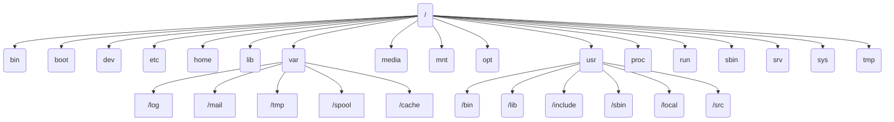

# 三、文件系统

## 3.1 Ubuntu的文件系统

**文件系统简介**
定义：文件系统是操作系统用于明确磁盘或分区上的文件的方法和数据结构，即文件在磁盘上的组织方法。
操作系统中负责管理和存储文件信息的软件机构称为文件（管理）系统。

作用：负责为用户建立文件，存入、读出、修改、转储文件，控制文件的存取，当用户不再使用时撤销文件等
文件系统对应硬盘的一个分区，而不是整个硬盘不同的分区可以有不同的文件系统（使用了VFS）

文件系统由三部分组成：

- 与文件管理有关的软件
- 被管理的文件
- 实施文件管理所需数据结构。

**目录（文件夹）**

- 目录是文件系统维护所需的特殊文件
- 目录中为内部每个文件设立表目
- 目录没有扩展名，而是提供了指向对应空间的地址
- 目录大小（通常是4K）不等于目录内所有文件的大小

**建立文件系统**
大部分程序基于文件系统进行操作一个分区或磁盘在作为文件系统使用前，需要进行初始化（格式化），并将记录数据结构写到磁盘上这个过程就叫做建立文件系统

**Liux文件系统架构**

Linux文件系统

- 现代Linux内核几乎支持计算机系统中所有文件系统
- 从基本的FAT到高性能文件系统
- Linux操作系统从一开始就追求让用户使用多个文件系统

**Linux支持的文件系统**

1. ext4：是Linux系统下的日志文件系统，是ext3文件系统的后继版本
2. NFS：网络文件系统，由SUN发明，主要用于远程文件共享
3. MS-DOS：MS-DOS文件系统
4. FAT：WindowsXP操作系统采用的文件系统
5. NTFS：WindowsNT/XP操作系统采用的文件系统
6. HPFS：OS/2操作系统采用的文件系统
7. PROC： 虚拟的进程文件系统
8. IS09660：大部分光盘所采用的文件系统，挂载光盘时指定此文件系统
9. ufsSun：OS所采用的文件系统
10. NCPFS：Novell服务器所采用的文件系统
11. SMBFS：Samba的共享文件系统
12. XFS：由SGI开发的先进的日志文件系统，支持超大容量文件
13. JFS：IBM的AIX使用的日志文件系统
14. ReiserFS：基于平衡树结构的文件系统虚拟文件系统（VirtualFileSystem，VFS）

**Ext2文件系统**

Ext2文件系统和其它现代Unix使用的文件系统非常相似，但更接近于BSD系统所用的Berkeley Fast File system
Ext2文件系统的特点是存取文件的性能极好

- 其单一文件大小与文件系统本身的容量上限和文件系统本身的族大小有关。
- 在一般常见的×86计算机系统中簇最大为4KB
- 单一文件大小上限为2048GB （2T）

文件系统的容量上限为16384GB

ext4

- ext4是第四代扩展文件系统，是Linux系统下的文件系统
- 2008年12月25日，ext4文件系统随着Linux
- Kernel2.6.28的正式版本发布成为稳定发布版
- ext4的文件系统容量达到1EB
- 单个文件容量达到16TB

**Ubuntu的目录结构**

文件的路径名指的就是从某个目录开始，穿过整个文件系统，直至到达目标文件而经过的一条目录层次路径。/usr/bin/find

绝对路径：指文件的准确位置且以根目录为起点，例如“/usr/game/gnect
相对路径：相对于用户当前位置的一个文件或录的位置，如果用户现在处于“/usr”中，只需要“cgame/gnect”就可以确定这个文件而不需要将根目录写出

组织结构

- Windows每个盘符下都是一个树形分层结构，有若干根节点
- Linux是一个树形分层结构组织，只有一个根节点

| 目录名 | 描述                                     |
| ------ | ---------------------------------------- |
| /      | 根目录，整个文件系统的起始点             |
| /bin   | 存放二进制可执行文件                     |
| /boot  | 存放启动Linux时使用的必要文件            |
| /dev   | 存放设备文件                             |
| /etc   | 存放系统配置文件                         |
| /home  | 用户主目录                               |
| /lib   | 存放共享库文件                           |
| /media | 自动挂载的设备（如U盘、光驱等）的挂载点  |
| /mnt   | 手动挂载的设备的挂载点                   |
| /opt   | 第三方应用程序目录                       |
| /proc  | 虚拟文件系统，提供了内核和进程的信息     |
| /root  | 超级用户（root）的主目录                 |
| /run   | 存放系统运行时需要的临时文件             |
| /sbin  | 存放超级用户使用的系统管理程序           |
| /srv   | 存放服务相关文件                         |
| /sys   | 虚拟文件系统，提供了内核设备树的信息     |
| /tmp   | 存放临时文件                             |
| /usr   | 存放大部分用户安装的应用程序和文件       |
| /var   | 存放经常变化的文件，如日志文件和缓存文件 |

与Windows的差别

1. Linux中是严格区分大小写的
2. Linux系统中文件类型与后名没有直接关系

## 3.2 挂载与卸载文件系统

创建文件系统
两种方法创建文件系统：
 1、使用通用的mkfs命令，在选定的磁盘分区中创建指定文件系统；
 2、利用各种特定的工具，如mke2fs、mkfs.ext2或mkfs.vfat等，在选定的磁盘分区上直接创建特定类型的文件系统。

创建文件系统时，最基本的工具通常是mkfs命令
对于Ext2/Ext3文件系统，可使用mke2fs/mkfs.ex2/mkfs.ext2

**创建文件系统**
示例：
mkfs.ntfs /dev/sdb1
#将/dev/sdb1 格式化为ntfs格式mkfs-text4/dev/sdb2
#将/dev/sdb2分区格式化为ext4格式

**挂载文件系统**
对于一个文件系统或分区而言，如果想要使用，必须先对其进行挂载操作。
挂载”就是把新建的文件系统安装到Linux文件系统目录层次结构的某个安装点上。也就是说，挂载点必须是目录，可以将挂载看成是一个连接动作。

使用mount命令挂载
为什么有挂载？Windows有挂载吗？
linux只有一个根目录，新建分区要使用必须在根目录下创建一个目录指向这个分区，点击创建的目录实际是打开新的分区
windows分区超过26个的处理，也是创建文件夹快捷方式
26个盘符以内windows的做法是帮我们挂载（直接给个新的盘符）

mount命令示例：
#将分区sdb1  挂载到/mnt/myftproot:
sudo  mkdir   /mnt/myftproot
mount   /dev/sdb1   /mnt/myftprootdf-hT命令查看挂载是否成功，文件系统类型和大小

**盘分区挂载步骤**
第一步：创建硬盘分区
准备工作：为Ubuntu添加一块硬盘，大小5G1、

查询磁盘信息    --sudofdisk-l或Is -l/dev/sd*为磁盘分区       

-sudo fdisk /dev/sdb为磁盘分区，并指定分区类型盘分区挂载步骤

第二步：创建文件系统
格式化分区sudomkfs.ext4/dev/sdb1创建可用的文件系统

第三步：挂载文件系统
挂载分区，使分区可用--ssudo mount/dev/sdbi/mnt先在Linux系统上创建载入点，再将新分区载入

**卸载文件系统**
卸载文件系统意味着把文件系统从挂载点移走删除/etc/mtab文件中的挂载项。
在文件系统的管理与维护工作中，有些工作只能在未挂载的文件系统中执行，因此需要进行卸载文件系统操作。
当不再需要临时挂载的文件系统时，也应及时进行卸载操作，避免数据的误操作。

载文件系统的命令是umount
卸载文件系统/dev/sdb1，挂载在/mnt/myftproot
user@user-desktop:/udoumount/mnt/myfptroot
可以看到，文件系统已经被卸载。

查看/etc/mtab文件可以得到同样的结果。user@user-desktop:/ cat /etc/mtab
