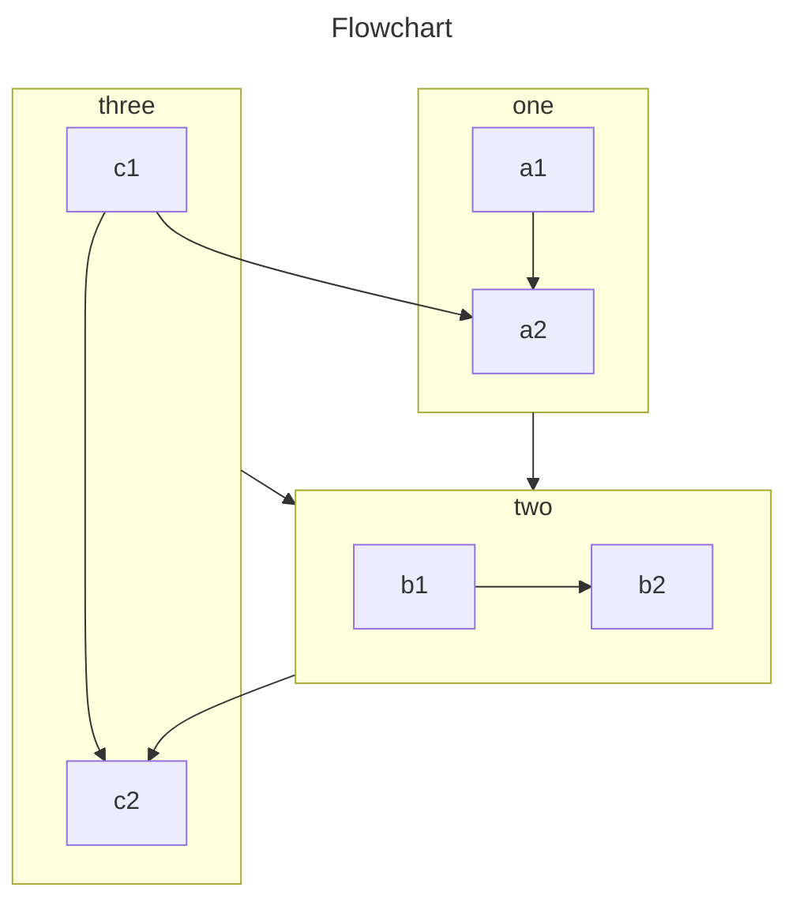

# 文档说明

### 标题

> 标题也和思维导图相关

```markdown
# 一级标题是主标题

## 二级标题是大标题

### 三级标题是次标题

#### 四级标题和**加粗**均不显示在侧目录
```


### 引用总结

> 引用：这里是引用

> 总结：这里是总结

> 简短说明：这里是简短说明


### 选项卡

> 文本相似处使用

::: tabs

@tab apple

Apple

@tab banana

Banana

:::


### 代码选项卡

> 代码多选处使用

::: code-tabs

@tab yarn

```bash
yarn add -D vuepress-theme-hope
```

@tab npm

```bash
npm i -D vuepress-theme-hope
```

:::


### Mermaid

> 简单图表使用



### 卡片

> 特殊推荐链接，如友链，官网，管方文档等（参考链接除外）

```card
title: Mr.Hope
desc: Where there is light, there is hope
logo: https://mister-hope.com/logo.svg
link: https://mister-hope.com
color: rgba(253, 230, 138, 0.15)
```


### Badge

- <Badge text="推荐" type="tip" vertical="middle" />
- <Badge text="警示" type="warning" vertical="middle" />
- <Badge text="不推荐" type="danger" vertical="middle" />
- <Badge text="常用" type="info" vertical="middle" />
- <Badge text="普通" type="note" vertical="middle" />


### 自定义容器

::: info
信息容器
:::

::: info 前情提要
信息容器
:::

::: info 重要说明
信息容器
:::

::: note
注释容器
:::

::: note 说明
注释容器
:::

::: tip
提示容器
:::

::: warning
警告容器
:::

::: danger
危险容器
:::

::: details
详情容器
:::


### 代码块高亮

> 重要代码处使用

```java {2-3}
int a = 1;
int b = 2;
int c = a+b;
System.out.println(c);
```


### 导入代码块

> 导入代码块（不必了解，主要是提示我，导入的语法）

```markdown
<!-- 最简单的语法 -->
@[code](../foo.js)

<!-- 仅导入第 1 行至第 10 行 -->
@[code{1-10}](../foo.js)

<!-- 行高亮 -->
@[code js{2,4-5}](../foo.js)
```
