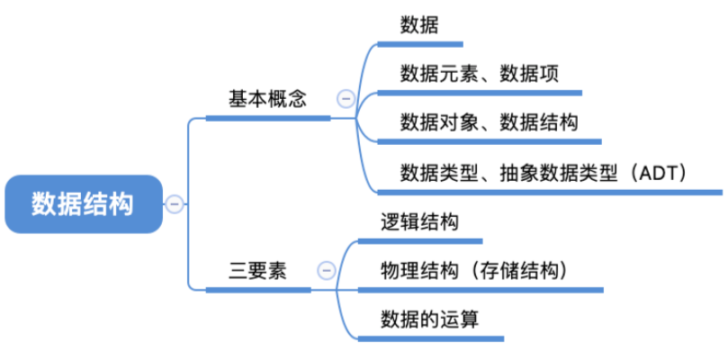

# 数据结构

## 第一章: 简介
### 1.1 数据结构的定义

## 基本概念



- 数据： 数据是信息的载体，是描述客观事物属性的数、字符及所有能输入到计算机中并被计算机程序识别和处理的符号的集合。数据是计算机程序加工的原料。（二进制 0 和 1）

- 数据元素、数据项： 数据元素是数据的基本单位，通常作为一个整体进行考虑和处理。
  一个数据元素可由若干数据项组成，数据项是构成数据元素的不可分割的最小单位。
- 数据结构、数据对象： 数据结构是相互之间存在一种或多种特定关系的数据元素的集合。
  数据对象是具有相同性质的数据元素的集合，是数据的一个子集。
- 数据的运算：施加在数据上的运算包括运算的定义和实现。运算的定义是针对逻辑结构的， 指出运算的功能；运算的实现是针对存储结构的，指出运算的具体操作步骤。

### 逻辑结构——数据元素之间的逻辑关系是什么？

- 集合：各个元素同属一个集 合，别无其他关系
- 线性结构：数据元素之间是一对一的关系。 除了第一个元素，所有元素都有唯一前驱；除了最后一个元素，所有元素都有唯一后继
- 树形结构：数据元素之间是 一对多的关系
- 图状结构（网状结构）：数据元素之间是 多对多的关系

### 数据的物理结构（存储结构）——如何用计算机表示数据元素的逻辑关系？

- 顺序存储：把逻辑上相邻的元素存储在物理位置 上也相邻的存储单元中，元素之间的关系由存储单元的邻接关系来体现
- 链式存储：逻辑上相邻的元素在物理位置上可以 不相邻，借助指示元素存储地址的指针来表示元素之间的逻辑关系。
- 索引存储：在存储元素信息的同时，还建立附加 的索引表。索引表中的每项称为索引项，索引项 的一般形式是（关键字，地址）
- 散列存储：根据元素的关键字直接计算出该元素 的存储地址，又称哈希（Hash）存储

### 理解

1. 若采用顺序存储，则各个数据元素在物理上必须是连续的；若采用 非顺序存储，则各个数据元素在物理上可以是离散的。
2. 数据的存储结构会影响存储空间分配的方便程度
3. 数据的存储结构会影响对数据运算的速度

### 数据类型、抽象数据类型 

数据类型是一个值的集合和定义在此集合上的一组操作的总称。

1. 原子类型：其值不可再分的数据类型。
2. 结构类型：其值可以再分解为若干成分（分量）的数据类型。
3. 抽象数据类型（Abstract Data Type，ADT）：是抽象数据组织及与之相关的操作


### 1.2 数据结构的重要性


### 1.3 常见的数据结构分类

| 数据结构                  | 变种                                                         |
| ------------------------- | ------------------------------------------------------------ |
| 顺序线性表：向量 Vector   |                                                              |
| 单链表 Singly Linked List | 1. 双向链表 Double Linked Lists 2. 静态链表 Static List 3. 对称矩阵 Symmetric Matrix 4. 稀疏矩阵 Sparse Matrix |
| 哈希表 Hash Table         | 1. 散列函数 Hash Function 2. 解决碰撞/填充因子 Collision Resolution |
| 栈和队列 Stack & Queue    | 1. 广义表 Generalized List/GList 2. 双端队列 Deque           |
| 队列 Queue                | 1. 链表实现 Linked List Implementation 2. 循环数组实现 ArrayQueue 3. 双端队列 Deque 4. 优先队列 Priority Queue 5. 循环队列 Circular Queue |
| 字符串 String             | 1. KMP 算法 2. 有限状态自动机 3. 模式匹配有限状态自动机 4. BM 模式匹配算法 5. BM-KMP 算法 6. BF 算法 |
| 树 Tree                   | 1. 二叉树 Binary Tree 2. 并查集 Union-Find 3. Huffman 树     |
| 数组实现的堆 Heap         | 1. 极大堆和极小堆 Max Heap and Min Heap 2. 极大极小堆 3. 双端堆 Deap 4. d 叉堆 |
| 树实现的堆 Heap           | 1. 左堆 Leftist Tree/Leftist Heap 2. 扁堆 3. 二项式堆 4. 斐波那契堆 Fibonacco Heap 5. 配对堆 Pairing Heap |
| 查找 Search               | 1. 哈希表 Hash 2. 跳跃表 Skip List 3. 排序二叉树 Binary Sort Tree 4. AVL 树 5. B 树 / B+ 树 / B* 树 6. AA 树 7. 红黑树 Red Black Tree 8. 排序二叉堆 Binary Heap 9. Splay 树 10. 双链树 Double Chained Tree 11. Trie 树 12. R 树 |


## 第二章: 算法复杂度分析

### 2.1 时间复杂度

#### 统计时间增长趋势

时间复杂度分析统计的不是算法运行时间，**而是算法运行时间随着数据量变大时的增长趋势**。

“时间增长趋势”这个概念比较抽象，我们通过一个例子来加以理解。

相较于直接统计算法的运行时间，时间复杂度分析有哪些特点呢？

- **时间复杂度能够有效评估算法效率**
- **时间复杂度的推算方法更简便**
- **时间复杂度也存在一定的局限性**


#### 时间复杂度分析的要点

- **只关注循环执行次数最多的一段代码**
- **加法法则：总复杂度等于量级最大的那段代码的复杂度**
- **乘法法则：嵌套代码的复杂度等于嵌套内外代码复杂度的乘积**


#### 大 O 表示法

假设问题的规模为 n，则程序的时间复杂度表示为 `T(n)`。**代码的执行时间 T(n) 与每行代码的执行次数 n 成正比**。

当 n 增大时，T(n) 也随之增大，想要准确估计其变化比较困难。所以，可以采用大 O 时间复杂度来粗略估计其复杂度，其表达式为：**`T(n) = O(f(n))`**。

**大 O 表示法**实际上并不具体表示代码真正的执行时间，而是表示**代码执行时间随数据规模增长的变化趋势**，所以，也叫作**渐进时间复杂度**（asymptotic time complexity），简称**时间复杂度**。


#### 常见类型

常数阶 $O(1)$<对数阶 $O(logn)$<线性阶 $O(n)$< 线性对数阶 $O(nlogn)$<平方阶 $O(n^2)$<指数阶 $O(2^n)$<阶乘阶 $O(n!)$


[](https://www.hello-algo.com/chapter_computational_complexity/time_complexity.assets/time_complexity_common_types.png)

|                      |                                                              |                                                              |
| -------------------- | ------------------------------------------------------------ | ------------------------------------------------------------ |
| 常数阶 O(1)          | 常数阶的操作数量与输入数据大小 n 无关，即不随着 n 的变化而变化。 |                                                              |
| 线性阶 O(n)          | 线性阶的操作数量相对于输入数据大小 n 以线性级别增长。        | 线性阶通常出现在单层循环中，比如遍历数组和遍历链表等操作     |
| 平方阶 O(n^2)        | 平方阶的操作数量相对于输入数据大小 n 以平方级别增长。        | 平方阶通常出现在嵌套循环中，外层循环和内层循环的时间复杂度都为 O(n)，因此总体的时间复杂度为 O(n^2) 比如冒泡排序等 |
| 指数阶 O(2^n)        | 生物学的“细胞分裂”是指数阶增长的典型例子：初始状态为 1 个细胞，分裂一轮后变为 2 个，分裂两轮后变为 4 个，以此类推。 | 指数阶常出现于递归函数中。指数阶增长非常迅速，在穷举法（暴力搜索、回溯等）中比较常见。 |
| 对数阶 O(log n)      | 与指数阶相反，对数阶反映了“每轮缩减到一半”的情况。由于每轮缩减到一半，因此循环次数是 2^n 的反函数。 | 与指数阶类似，对数阶也常出现于递归函数中。对数阶常出现于基于分治策略的算法中，体现了“一分为多”和“化繁为简”的算法思想。 |
| 线性对数阶O(n log n) | 线性对数阶常出现于嵌套循环中，两层循环的时间复杂度分别为 O(log⁡n) 和 O(n) 。 | 主流排序算法的时间复杂度通常为线性对数阶，例如快速排序、归并排序、堆排序等。 |
| 阶乘阶O(n!)          | 阶乘阶对应数学上的“全排列”问题。给定 n 个互不重复的元素，求其所有可能的排列方案 | 阶乘通常使用递归实现。阶乘阶比指数阶增长得更快，在 n 较大时也是不可接受的。 |


### 2.2 空间复杂度

「空间复杂度 space complexity」用于衡量算法占用内存空间随着数据量变大时的增长趋势。这个概念与时间复杂度非常类似，只需将“运行时间”替换为“占用内存空间”。

#### 2.4.1  算法相关空间

算法在运行过程中使用的内存空间主要包括以下几种。

- **输入空间**：用于存储算法的输入数据。
- **暂存空间**：用于存储算法在运行过程中的变量、对象、函数上下文等数据。
- **输出空间**：用于存储算法的输出数据。

一般情况下，空间复杂度的统计范围是“暂存空间”加上“输出空间”。

暂存空间可以进一步划分为三个部分。

- **暂存数据**：用于保存算法运行过程中的各种常量、变量、对象等。
- **栈帧空间**：用于保存调用函数的上下文数据。系统在每次调用函数时都会在栈顶部创建一个栈帧，函数返回后，栈帧空间会被释放。
- **指令空间**：用于保存编译后的程序指令，在实际统计中通常忽略不计。

在分析一段程序的空间复杂度时，**我们通常统计暂存数据、栈帧空间和输出数据三部分,在递归函数中，需要注意统计栈帧空间**。

#### 2.4.3  常见类型

常数阶 $O(1)$<对数阶 $O(logn)$<线性阶 $O(n)$< 线性对数阶 $O(nlogn)$<平方阶 $O(n^2)$<指数阶 $O(2^n)$<阶乘阶 $O(n!)$

[](https://www.hello-algo.com/chapter_computational_complexity/space_complexity.assets/space_complexity_common_types.png)

|                 |                                                           |                                                              |
| --------------- | --------------------------------------------------------- | ------------------------------------------------------------ |
| 常数阶 O(1)     | 常数阶常见于数量与输入数据大小 n 无关的常量、变量、对象。 | 需要注意的是，在循环中初始化变量或调用函数而占用的内存，在进入下一循环后就会被释放，因此不会累积占用空间，空间复杂度仍为 O(1) ： |
| 线性阶 O(n)     |                                                           | 线性阶常见于元素数量与 n 成正比的数组、链表、栈、队列等：    |
| 平方阶 O(n^2)   |                                                           | 平方阶常见于矩阵和图，元素数量与 n 成平方关系：              |
| 指数阶 O(2^n)   |                                                           | 指数阶常见于二叉树。                                         |
| 对数阶 O(log n) |                                                           | 对数阶常见于分治算法。                                       |


### 2.3 最坏情况与平均情况分析

**算法的时间效率往往不是固定的，而是与输入数据的分布有关**。

- **最好情况时间复杂度**（best case time complexity）：**在最理想的情况下，执行代码的时间复杂度**。例如：在最理想的情况下，要查找的变量 x 正好是数组的第一个元素，此时最好情况时间复杂度为 1。用 Ω 记号表示
- **最坏情况时间复杂度**（worst case time complexity）：**在最糟糕的情况下，执行代码的时间复杂度**。例如：在最理想的情况下，要查找的变量 x 正好是数组的最后个元素，此时最好情况时间复杂度为 n。使用大 O 记号表示。
- **平均情况时间复杂度**（average case time complexity）：平均时间复杂度的全称应该叫**加权平均时间复杂度**或者**期望时间复杂度**。用 Θ 记号来表示。

值得说明的是，我们在实际中很少使用最佳时间复杂度，因为通常只有在很小概率下才能达到，可能会带来一定的误导性。**而最差时间复杂度更为实用，因为它给出了一个效率安全值**，让我们可以放心地使用算法。


## 第三章: 线性数据结构

### 3.1 数组 (Array)

「数组 array」是一种线性数据结构，其将相同类型的元素存储在连续的内存空间中。我们将元素在数组中的位置称为该元素的「索引 index」。

### 数组常用操作

### 1. 初始化数组

我们可以根据需求选用数组的两种初始化方式：无初始值、给定初始值。在未指定初始值的情况下，大多数编程语言会将数组元素初始化为 0 ：

```c
/* 初始化数组 */
int arr[5] = { 0 }; // { 0, 0, 0, 0, 0 }
int nums[5] = { 1, 3, 2, 5, 4 };
```

#### 2.  访问元素

数组元素被存储在连续的内存空间中，这意味着计算数组元素的内存地址非常容易。给定数组内存地址（首元素内存地址）和某个元素的索引，我们可以使用图 4-2 所示的公式计算得到该元素的内存地址，从而直接访问该元素。

在数组中访问元素非常高效，我们可以在 O(1) 时间内随机访问数组中的任意一个元素。

```c
/* 随机访问元素 */
int randomAccess(int *nums, int size) {
    // 在区间 [0, size) 中随机抽取一个数字
    int randomIndex = rand() % size;
    // 获取并返回随机元素
    int randomNum = nums[randomIndex];
    return randomNum;
}
```

#### 3.  插入元素

数组元素在内存中是“紧挨着的”，它们之间没有空间再存放任何数据。如图 4-3 所示，如果想在数组中间插入一个元素，则需要将该元素之后的所有元素都向后移动一位，之后再把元素赋值给该索引。

```c
/* 在数组的索引 index 处插入元素 num */
void insert(int *nums, int size, int num, int index) {
    // 把索引 index 以及之后的所有元素向后移动一位
    for (int i = size - 1; i > index; i--) {
        nums[i] = nums[i - 1];
    }
    // 将 num 赋给 index 处的元素
    nums[index] = num;
}
```

#### 4.  删除元素

同理，若想删除索引 n 处的元素，则需要把索引 n 之后的元素都向前移动一位。

请注意，删除元素完成后，原先末尾的元素变得“无意义”了，所以我们无须特意去修改它。

```c
/* 删除索引 index 处的元素 */
// 注意：stdio.h 占用了 remove 关键词
void removeItem(int *nums, int size, int index) {
    // 把索引 index 之后的所有元素向前移动一位
    for (int i = index; i < size - 1; i++) {
        nums[i] = nums[i + 1];
    }
}
```

总的来看，数组的插入与删除操作有以下缺点。

- **时间复杂度高**：数组的插入和删除的平均时间复杂度均为 O(n) ，其中 n 为数组长度。
- **丢失元素**：由于数组的长度不可变，因此在插入元素后，超出数组长度范围的元素会丢失。
- **内存浪费**：我们可以初始化一个比较长的数组，只用前面一部分，这样在插入数据时，丢失的末尾元素都是“无意义”的，但这样做会造成部分内存空间浪费。

#### 5.  遍历数组

在大多数编程语言中，我们既可以通过索引遍历数组，也可以直接遍历获取数组中的每个元素：

```c
/* 遍历数组 */
void traverse(int *nums, int size) {
    int count = 0;
    // 通过索引遍历数组
    for (int i = 0; i < size; i++) {
        count += nums[i];
    }
}
```

#### 6.  查找元素

在数组中查找指定元素需要遍历数组，每轮判断元素值是否匹配，若匹配则输出对应索引。

因为数组是线性数据结构，所以上述查找操作被称为“线性查找”。

```c
/* 在数组中查找指定元素 */
int find(int *nums, int size, int target) {
    for (int i = 0; i < size; i++) {
        if (nums[i] == target)
            return i;
    }
    return -1;
}
```

#### 7.  扩容数组

在复杂的系统环境中，程序难以保证数组之后的内存空间是可用的，从而无法安全地扩展数组容量。因此在大多数编程语言中，**数组的长度是不可变的**。

如果我们希望扩容数组，则需重新建立一个更大的数组，然后把原数组元素依次复制到新数组。这是一个 O(n) 的操作，在数组很大的情况下非常耗时。代码如下所示：

```c
/* 扩展数组长度 */
int *extend(int *nums, int size, int enlarge) {
    // 初始化一个扩展长度后的数组
    int *res = (int *)malloc(sizeof(int) * (size + enlarge));
    // 将原数组中的所有元素复制到新数组
    for (int i = 0; i < size; i++) {
        res[i] = nums[i];
    }
    // 初始化扩展后的空间
    for (int i = size; i < size + enlarge; i++) {
        res[i] = 0;
    }
    // 返回扩展后的新数组
    return res;
}
```

##### 4.1.2  数组的优点与局限性

数组存储在连续的内存空间内，且元素类型相同。这种做法包含丰富的先验信息，系统可以利用这些信息来优化数据结构的操作效率。

- **空间效率高**：数组为数据分配了连续的内存块，无须额外的结构开销。
- **支持随机访问**：数组允许在 �(1) 时间内访问任何元素。
- **缓存局部性**：当访问数组元素时，计算机不仅会加载它，还会缓存其周围的其他数据，从而借助高速缓存来提升后续操作的执行速度。

连续空间存储是一把双刃剑，其存在以下局限性。

- **插入与删除效率低**：当数组中元素较多时，插入与删除操作需要移动大量的元素。
- **长度不可变**：数组在初始化后长度就固定了，扩容数组需要将所有数据复制到新数组，开销很大。
- **空间浪费**：如果数组分配的大小超过实际所需，那么多余的空间就被浪费了。

##### 4.1.3  数组典型应用

数组是一种基础且常见的数据结构，既频繁应用在各类算法之中，也可用于实现各种复杂数据结构。

- **随机访问**：如果我们想随机抽取一些样本，那么可以用数组存储，并生成一个随机序列，根据索引实现随机抽样。
- **排序和搜索**：数组是排序和搜索算法最常用的数据结构。快速排序、归并排序、二分查找等都主要在数组上进行。
- **查找表**：当需要快速查找一个元素或其对应关系时，可以使用数组作为查找表。假如我们想实现字符到 ASCII 码的映射，则可以将字符的 ASCII 码值作为索引，对应的元素存放在数组中的对应位置。
- **机器学习**：神经网络中大量使用了向量、矩阵、张量之间的线性代数运算，这些数据都是以数组的形式构建的。数组是神经网络编程中最常使用的数据结构。
- **数据结构实现**：数组可以用于实现栈、队列、哈希表、堆、图等数据结构。例如，图的邻接矩阵表示实际上是一个二维数组。


### 3.2 链表 (Linked List)

内存空间是所有程序的公共资源，在一个复杂的系统运行环境下，空闲的内存空间可能散落在内存各处。我们知道，存储数组的内存空间必须是连续的，而当数组非常大时，内存可能无法提供如此大的连续空间。此时链表的灵活性优势就体现出来了。

「链表 linked list」是一种线性数据结构，其中的每个元素都是一个节点对象，各个节点通过“引用”相连接。引用记录了下一个节点的内存地址，通过它可以从当前节点访问到下一个节点。

链表的设计使得各个节点可以分散存储在内存各处，它们的内存地址无须连续。

[](https://www.hello-algo.com/chapter_array_and_linkedlist/linked_list.assets/linkedlist_definition.png)


，链表的组成单位是「节点 node」对象。每个节点都包含两项数据：节点的“值”和指向下一节点的“引用”。

- 链表的首个节点被称为“头节点”，最后一个节点被称为“尾节点”。
- 尾节点指向的是“空”，它在 Java、C++ 和 Python 中分别被记为 `null`、`nullptr` 和 `None` 。
- 在 C、C++、Go 和 Rust 等支持指针的语言中，上述“引用”应被替换为“指针”。

如以下代码所示，链表节点 `ListNode` 除了包含值，还需额外保存一个引用（指针）。因此在相同数据量下，**链表比数组占用更多的内存空间**。

```c
/* 链表节点结构体 */
typedef struct ListNode {
    int val;               // 节点值
    struct ListNode *next; // 指向下一节点的指针
} ListNode;

/* 构造函数 */
ListNode *newListNode(int val) {
    ListNode *node;
    node = (ListNode *) malloc(sizeof(ListNode));
    node->val = val;
    node->next = NULL;
    return node;
}
```

### 4.2.1  链表常用操作

#### 1.  初始化链表

建立链表分为两步，第一步是初始化各个节点对象，第二步是构建节点之间的引用关系。初始化完成后，我们就可以从链表的头节点出发，通过引用指向 `next` 依次访问所有节点。

```c
/* 初始化链表 1 -> 3 -> 2 -> 5 -> 4 */
// 初始化各个节点
ListNode* n0 = newListNode(1);
ListNode* n1 = newListNode(3);
ListNode* n2 = newListNode(2);
ListNode* n3 = newListNode(5);
ListNode* n4 = newListNode(4);
// 构建节点之间的引用
n0->next = n1;
n1->next = n2;
n2->next = n3;
n3->next = n4;
```

数组整体是一个变量，比如数组 `nums` 包含元素 `nums[0]` 和 `nums[1]` 等，而链表是由多个独立的节点对象组成的。**我们通常将头节点当作链表的代称**，比如以上代码中的链表可记作链表 `n0` 。

#### 2.  插入节点

在链表中插入节点非常容易。如图 4-6 所示，假设我们想在相邻的两个节点 `n0` 和 `n1` 之间插入一个新节点 `P` ，**则只需改变两个节点引用（指针）即可**，时间复杂度为 O(1) 。

相比之下，在数组中插入元素的时间复杂度为 O(n) ，在大数据量下的效率较低。

```c
/* 在链表的节点 n0 之后插入节点 P */
void insert(ListNode *n0, ListNode *P) {
    ListNode *n1 = n0->next;
    P->next = n1;
    n0->next = P;
}
```

#### 3.  删除节点

如图 4-7 所示，在链表中删除节点也非常方便，**只需改变一个节点的引用（指针）即可**。

请注意，尽管在删除操作完成后节点 `P` 仍然指向 `n1` ，但实际上遍历此链表已经无法访问到 `P` ，这意味着 `P` 已经不再属于该链表了。

```c
/* 删除链表的节点 n0 之后的首个节点 */
// 注意：stdio.h 占用了 remove 关键词
void removeItem(ListNode *n0) {
    if (!n0->next)
        return;
    // n0 -> P -> n1
    ListNode *P = n0->next;
    ListNode *n1 = P->next;
    n0->next = n1;
    // 释放内存
    free(P);
}
```

#### 4.  访问节点

**在链表中访问节点的效率较低**。如上一节所述，我们可以在 O(1) 时间下访问数组中的任意元素。链表则不然，程序需要从头节点出发，逐个向后遍历，直至找到目标节点。也就是说，访问链表的第 n 个节点需要循环 n−1 轮，时间复杂度为 O(n) 。

```c
/* 访问链表中索引为 index 的节点 */
ListNode *access(ListNode *head, int index) {
    for (int i = 0; i < index; i++) {
        if (head == NULL)
            return NULL;
        head = head->next;
    }
    return head;
}
```

#### 5.  查找节点

遍历链表，查找其中值为 `target` 的节点，输出该节点在链表中的索引。此过程也属于线性查找。代码如下所示：

```c
/* 在链表中查找值为 target 的首个节点 */
int find(ListNode *head, int target) {
    int index = 0;
    while (head) {
        if (head->val == target)
            return index;
        head = head->next;
        index++;
    }
    return -1;
}
```

### 4.2.2  数组 vs. 链表

表 4-1 总结了数组和链表的各项特点并对比了操作效率。由于它们采用两种相反的存储策略，因此各种性质和操作效率也呈现对立的特点。

表 4-1  数组与链表的效率对比

|          | 数组                           | 链表           |
| :------- | :----------------------------- | :------------- |
| 存储方式 | 连续内存空间                   | 分散内存空间   |
| 容量扩展 | 长度不可变                     | 可灵活扩展     |
| 内存效率 | 元素占用内存少、但可能浪费空间 | 元素占用内存多 |
| 访问元素 | �(1)                           | �(�)           |
| 添加元素 | �(�)                           | �(1)           |
| 删除元素 | �(�)                           | �(1)           |

## 4.2.3  常见链表类型

如图 4-8 所示，常见的链表类型包括三种。

- **单向链表**：即前面介绍的普通链表。单向链表的节点包含值和指向下一节点的引用两项数据。我们将首个节点称为头节点，将最后一个节点称为尾节点，尾节点指向空 `None` 。
- **环形链表**：如果我们令单向链表的尾节点指向头节点（首尾相接），则得到一个环形链表。在环形链表中，任意节点都可以视作头节点。
- **双向链表**：与单向链表相比，双向链表记录了两个方向的引用。双向链表的节点定义同时包含指向后继节点（下一个节点）和前驱节点（上一个节点）的引用（指针）。相较于单向链表，双向链表更具灵活性，可以朝两个方向遍历链表，但相应地也需要占用更多的内存空间。

```c
/* 双向链表节点结构体 */
typedef struct ListNode {
    int val;               // 节点值
    struct ListNode *next; // 指向后继节点的指针
    struct ListNode *prev; // 指向前驱节点的指针
} ListNode;

/* 构造函数 */
ListNode *newListNode(int val) {
    ListNode *node;
    node = (ListNode *) malloc(sizeof(ListNode));
    node->val = val;
    node->next = NULL;
    node->prev = NULL;
    return node;
}
```

### 4.2.4  链表典型应用

单向链表通常用于实现栈、队列、哈希表和图等数据结构。

- **栈与队列**：当插入和删除操作都在链表的一端进行时，它表现出先进后出的特性，对应栈；当插入操作在链表的一端进行，删除操作在链表的另一端进行，它表现出先进先出的特性，对应队列。
- **哈希表**：链式地址是解决哈希冲突的主流方案之一，在该方案中，所有冲突的元素都会被放到一个链表中。
- **图**：邻接表是表示图的一种常用方式，其中图的每个顶点都与一个链表相关联，链表中的每个元素都代表与该顶点相连的其他顶点。

双向链表常用于需要快速查找前一个和后一个元素的场景。

- **高级数据结构**：比如在红黑树、B 树中，我们需要访问节点的父节点，这可以通过在节点中保存一个指向父节点的引用来实现，类似于双向链表。
- **浏览器历史**：在网页浏览器中，当用户点击前进或后退按钮时，浏览器需要知道用户访问过的前一个和后一个网页。双向链表的特性使得这种操作变得简单。
- **LRU 算法**：在缓存淘汰（LRU）算法中，我们需要快速找到最近最少使用的数据，以及支持快速添加和删除节点。这时候使用双向链表就非常合适。

环形链表常用于需要周期性操作的场景，比如操作系统的资源调度。

- **时间片轮转调度算法**：在操作系统中，时间片轮转调度算法是一种常见的 CPU 调度算法，它需要对一组进程进行循环。每个进程被赋予一个时间片，当时间片用完时，CPU 将切换到下一个进程。这种循环操作可以通过环形链表来实现。
- **数据缓冲区**：在某些数据缓冲区的实现中，也可能会使用环形链表。比如在音频、视频播放器中，数据流可能会被分成多个缓冲块并放入一个环形链表，以便实现无缝播放。


### 列表

「列表 list」是一个抽象的数据结构概念，它表示元素的有序集合，支持元素访问、修改、添加、删除和遍历等操作，无须使用者考虑容量限制的问题。列表可以基于链表或数组实现。

- 链表天然可以看作一个列表，其支持元素增删查改操作，并且可以灵活动态扩容。
- 数组也支持元素增删查改，但由于其长度不可变，因此只能看作一个具有长度限制的列表。

当使用数组实现列表时，**长度不可变的性质会导致列表的实用性降低**。这是因为我们通常无法事先确定需要存储多少数据，从而难以选择合适的列表长度。若长度过小，则很可能无法满足使用需求；若长度过大，则会造成内存空间浪费。

为解决此问题，我们可以使用「动态数组 dynamic array」来实现列表。它继承了数组的各项优点，并且可以在程序运行过程中进行动态扩容。

实际上，**许多编程语言中的标准库提供的列表是基于动态数组实现的**，例如 Python 中的 `list` 、Java 中的 `ArrayList` 、C++ 中的 `vector` 和 C# 中的 `List` 等。在接下来的讨论中，我们将把“列表”和“动态数组”视为等同的概念。

### 4.3.1  列表常用操作

### 1.  初始化列表

我们通常使用“无初始值”和“有初始值”这两种初始化方法：

```
// C 未提供内置动态数组
```

### 2.  访问元素

列表本质上是数组，因此可以在 �(1) 时间内访问和更新元素，效率很高。

```
// C 未提供内置动态数组
```

### 3.  插入与删除元素

相较于数组，列表可以自由地添加与删除元素。在列表尾部添加元素的时间复杂度为 �(1) ，但插入和删除元素的效率仍与数组相同，时间复杂度为 �(�) 。

```
// C 未提供内置动态数组
```

### 4.  遍历列表

与数组一样，列表可以根据索引遍历，也可以直接遍历各元素。

```
// C 未提供内置动态数组
```

### 5.  拼接列表

给定一个新列表 `nums1` ，我们可以将其拼接到原列表的尾部。

```
// C 未提供内置动态数组
```

### 6.  排序列表

完成列表排序后，我们便可以使用在数组类算法题中经常考查的“二分查找”和“双指针”算法。

```
// C 未提供内置动态数组
```

## 4.3.2  列表实现

许多编程语言内置了列表，例如 Java、C++、Python 等。它们的实现比较复杂，各个参数的设定也非常考究，例如初始容量、扩容倍数等。感兴趣的读者可以查阅源码进行学习。

为了加深对列表工作原理的理解，我们尝试实现一个简易版列表，包括以下三个重点设计。

- **初始容量**：选取一个合理的数组初始容量。在本示例中，我们选择 10 作为初始容量。
- **数量记录**：声明一个变量 `size` ，用于记录列表当前元素数量，并随着元素插入和删除实时更新。根据此变量，我们可以定位列表尾部，以及判断是否需要扩容。
- **扩容机制**：若插入元素时列表容量已满，则需要进行扩容。先根据扩容倍数创建一个更大的数组，再将当前数组的所有元素依次移动至新数组。在本示例中，我们规定每次将数组扩容至之前的 2 倍。

```c
/* 列表类 */
typedef struct {
    int *arr;        // 数组（存储列表元素）
    int capacity;    // 列表容量
    int size;        // 列表大小
    int extendRatio; // 列表每次扩容的倍数
} MyList;

/* 构造函数 */
MyList *newMyList() {
    MyList *nums = malloc(sizeof(MyList));
    nums->capacity = 10;
    nums->arr = malloc(sizeof(int) * nums->capacity);
    nums->size = 0;
    nums->extendRatio = 2;
    return nums;
}

/* 析构函数 */
void delMyList(MyList *nums) {
    free(nums->arr);
    free(nums);
}

/* 获取列表长度 */
int size(MyList *nums) {
    return nums->size;
}

/* 获取列表容量 */
int capacity(MyList *nums) {
    return nums->capacity;
}

/* 访问元素 */
int get(MyList *nums, int index) {
    assert(index >= 0 && index < nums->size);
    return nums->arr[index];
}

/* 更新元素 */
void set(MyList *nums, int index, int num) {
    assert(index >= 0 && index < nums->size);
    nums->arr[index] = num;
}

/* 在尾部添加元素 */
void add(MyList *nums, int num) {
    if (size(nums) == capacity(nums)) {
        extendCapacity(nums); // 扩容
    }
    nums->arr[size(nums)] = num;
    nums->size++;
}

/* 在中间插入元素 */
void insert(MyList *nums, int index, int num) {
    assert(index >= 0 && index < size(nums));
    // 元素数量超出容量时，触发扩容机制
    if (size(nums) == capacity(nums)) {
        extendCapacity(nums); // 扩容
    }
    for (int i = size(nums); i > index; --i) {
        nums->arr[i] = nums->arr[i - 1];
    }
    nums->arr[index] = num;
    nums->size++;
}

/* 删除元素 */
// 注意：stdio.h 占用了 remove 关键词
int removeItem(MyList *nums, int index) {
    assert(index >= 0 && index < size(nums));
    int num = nums->arr[index];
    for (int i = index; i < size(nums) - 1; i++) {
        nums->arr[i] = nums->arr[i + 1];
    }
    nums->size--;
    return num;
}

/* 列表扩容 */
void extendCapacity(MyList *nums) {
    // 先分配空间
    int newCapacity = capacity(nums) * nums->extendRatio;
    int *extend = (int *)malloc(sizeof(int) * newCapacity);
    int *temp = nums->arr;

    // 拷贝旧数据到新数据
    for (int i = 0; i < size(nums); i++)
        extend[i] = nums->arr[i];

    // 释放旧数据
    free(temp);

    // 更新新数据
    nums->arr = extend;
    nums->capacity = newCapacity;
}

/* 将列表转换为 Array 用于打印 */
int *toArray(MyList *nums) {
    return nums->arr;
}
```

### 3.3 栈 (Stack)

「栈 stack」是一种遵循先入后出逻辑的线性数据结构。

我们可以将栈类比为桌面上的一摞盘子，如果想取出底部的盘子，则需要先将上面的盘子依次移走。我们将盘子替换为各种类型的元素（如整数、字符、对象等），就得到了栈这种数据结构。

如图 5-1 所示，我们把堆叠元素的顶部称为“栈顶”，底部称为“栈底”。将把元素添加到栈顶的操作叫作“入栈”，删除栈顶元素的操作叫作“出栈”。

[

### 5.1.1  栈的常用操作

栈的常用操作如表 5-1 所示，具体的方法名需要根据所使用的编程语言来确定。在此，我们以常见的 `push()`、`pop()`、`peek()` 命名为例。

表 5-1  栈的操作效率

| 方法     | 描述                   | 时间复杂度 |
| :------- | :--------------------- | :--------- |
| `push()` | 元素入栈（添加至栈顶） | �(1)       |
| `pop()`  | 栈顶元素出栈           | �(1)       |
| `peek()` | 访问栈顶元素           | �(1)       |

通常情况下，我们可以直接使用编程语言内置的栈类。然而，某些语言可能没有专门提供栈类，这时我们可以将该语言的“数组”或“链表”当作栈来使用，并在程序逻辑上忽略与栈无关的操作。

```
// C 未提供内置栈
```

### 5.1.2  栈的实现

为了深入了解栈的运行机制，我们来尝试自己实现一个栈类。

栈遵循先入后出的原则，因此我们只能在栈顶添加或删除元素。然而，数组和链表都可以在任意位置添加和删除元素，**因此栈可以视为一种受限制的数组或链表**。换句话说，我们可以“屏蔽”数组或链表的部分无关操作，使其对外表现的逻辑符合栈的特性。

#### 1.  基于链表的实现

使用链表实现栈时，我们可以将链表的头节点视为栈顶，尾节点视为栈底。

如图 5-2 所示，对于入栈操作，我们只需将元素插入链表头部，这种节点插入方法被称为“头插法”。而对于出栈操作，只需将头节点从链表中删除即可。

```c
/* 基于链表实现的栈 */
typedef struct {
    ListNode *top; // 将头节点作为栈顶
    int size;      // 栈的长度
} LinkedListStack;

/* 构造函数 */
LinkedListStack *newLinkedListStack() {
    LinkedListStack *s = malloc(sizeof(LinkedListStack));
    s->top = NULL;
    s->size = 0;
    return s;
}

/* 析构函数 */
void delLinkedListStack(LinkedListStack *s) {
    while (s->top) {
        ListNode *n = s->top->next;
        free(s->top);
        s->top = n;
    }
    free(s);
}

/* 获取栈的长度 */
int size(LinkedListStack *s) {
    return s->size;
}

/* 判断栈是否为空 */
bool isEmpty(LinkedListStack *s) {
    return size(s) == 0;
}

/* 入栈 */
void push(LinkedListStack *s, int num) {
    ListNode *node = (ListNode *)malloc(sizeof(ListNode));
    node->next = s->top; // 更新新加节点指针域
    node->val = num;     // 更新新加节点数据域
    s->top = node;       // 更新栈顶
    s->size++;           // 更新栈大小
}

/* 访问栈顶元素 */
int peek(LinkedListStack *s) {
    if (s->size == 0) {
        printf("栈为空\n");
        return INT_MAX;
    }
    return s->top->val;
}

/* 出栈 */
int pop(LinkedListStack *s) {
    int val = peek(s);
    ListNode *tmp = s->top;
    s->top = s->top->next;
    // 释放内存
    free(tmp);
    s->size--;
    return val;
}
```

#### 2.  基于数组的实现

使用数组实现栈时，我们可以将数组的尾部作为栈顶。如图 5-3 所示，入栈与出栈操作分别对应在数组尾部添加元素与删除元素，时间复杂度都为 O(1) 。

```c
/* 基于数组实现的栈 */
typedef struct {
    int *data;
    int size;
} ArrayStack;

/* 构造函数 */
ArrayStack *newArrayStack() {
    ArrayStack *stack = malloc(sizeof(ArrayStack));
    // 初始化一个大容量，避免扩容
    stack->data = malloc(sizeof(int) * MAX_SIZE);
    stack->size = 0;
    return stack;
}

/* 析构函数 */
void delArrayStack(ArrayStack *stack) {
    free(stack->data);
    free(stack);
}

/* 获取栈的长度 */
int size(ArrayStack *stack) {
    return stack->size;
}

/* 判断栈是否为空 */
bool isEmpty(ArrayStack *stack) {
    return stack->size == 0;
}

/* 入栈 */
void push(ArrayStack *stack, int num) {
    if (stack->size == MAX_SIZE) {
        printf("栈已满\n");
        return;
    }
    stack->data[stack->size] = num;
    stack->size++;
}

/* 访问栈顶元素 */
int peek(ArrayStack *stack) {
    if (stack->size == 0) {
        printf("栈为空\n");
        return INT_MAX;
    }
    return stack->data[stack->size - 1];
}

/* 出栈 */
int pop(ArrayStack *stack) {
    int val = peek(stack);
    stack->size--;
    return val;
}
```

### 5.1.3  两种实现对比[

**支持操作**

两种实现都支持栈定义中的各项操作。数组实现额外支持随机访问，但这已超出了栈的定义范畴，因此一般不会用到。

**时间效率**

在基于数组的实现中，入栈和出栈操作都在预先分配好的连续内存中进行，具有很好的缓存本地性，因此效率较高。然而，如果入栈时超出数组容量，会触发扩容机制，导致该次入栈操作的时间复杂度变为 �(�) 。

在基于链表的实现中，链表的扩容非常灵活，不存在上述数组扩容时效率降低的问题。但是，入栈操作需要初始化节点对象并修改指针，因此效率相对较低。不过，如果入栈元素本身就是节点对象，那么可以省去初始化步骤，从而提高效率。

综上所述，当入栈与出栈操作的元素是基本数据类型时，例如 `int` 或 `double` ，我们可以得出以下结论。

- 基于数组实现的栈在触发扩容时效率会降低，但由于扩容是低频操作，因此平均效率更高。
- 基于链表实现的栈可以提供更加稳定的效率表现。

**空间效率**

在初始化列表时，系统会为列表分配“初始容量”，该容量可能超出实际需求；并且，扩容机制通常是按照特定倍率（例如 2 倍）进行扩容的，扩容后的容量也可能超出实际需求。因此，**基于数组实现的栈可能造成一定的空间浪费**。

然而，由于链表节点需要额外存储指针，**因此链表节点占用的空间相对较大**。

综上，我们不能简单地确定哪种实现更加节省内存，需要针对具体情况进行分析。

### 5.1.4  栈典型应用

- **浏览器中的后退与前进、软件中的撤销与反撤销**。每当我们打开新的网页，浏览器就会对上一个网页执行入栈，这样我们就可以通过后退操作回到上一个网页。后退操作实际上是在执行出栈。如果要同时支持后退和前进，那么需要两个栈来配合实现。
- **程序内存管理**。每次调用函数时，系统都会在栈顶添加一个栈帧，用于记录函数的上下文信息。在递归函数中，向下递推阶段会不断执行入栈操作，而向上回溯阶段则会不断执行出栈操作。

### 3.4 队列 (Queue)

「队列 queue」是一种遵循先入先出规则的线性数据结构。顾名思义，队列模拟了排队现象，即新来的人不断加入队列尾部，而位于队列头部的人逐个离开。

如图 5-4 所示，我们将队列头部称为“队首”，尾部称为“队尾”，将把元素加入队尾的操作称为“入队”，删除队首元素的操作称为“出队”。

[](https://www.hello-algo.com/chapter_stack_and_queue/queue.assets/queue_operations.png)


### 5.2.1  队列常用操作

队列的常见操作如表 5-2 所示。需要注意的是，不同编程语言的方法名称可能会有所不同。我们在此采用与栈相同的方法命名。

表 5-2  队列操作效率

| 方法名   | 描述                         | 时间复杂度 |
| :------- | :--------------------------- | :--------- |
| `push()` | 元素入队，即将元素添加至队尾 | O(1)       |
| `pop()`  | 队首元素出队                 | O(1)       |
| `peek()` | 访问队首元素                 | O(1)       |

我们可以直接使用编程语言中现成的队列类：

```
// C 未提供内置队列
```

### 5.2.2  队列实现

为了实现队列，我们需要一种数据结构，可以在一端添加元素，并在另一端删除元素，链表和数组都符合要求。

#### 1.  基于链表的实现

如图 5-5 所示，我们可以将链表的“头节点”和“尾节点”分别视为“队首”和“队尾”，规定队尾仅可添加节点，队首仅可删除节点。

```c
/* 基于链表实现的队列 */
typedef struct {
    ListNode *front, *rear;
    int queSize;
} LinkedListQueue;

/* 构造函数 */
LinkedListQueue *newLinkedListQueue() {
    LinkedListQueue *queue = (LinkedListQueue *)malloc(sizeof(LinkedListQueue));
    queue->front = NULL;
    queue->rear = NULL;
    queue->queSize = 0;
    return queue;
}

/* 析构函数 */
void delLinkedListQueue(LinkedListQueue *queue) {
    // 释放所有节点
    for (int i = 0; i < queue->queSize && queue->front != NULL; i++) {
        ListNode *tmp = queue->front;
        queue->front = queue->front->next;
        free(tmp);
    }
    // 释放 queue 结构体
    free(queue);
}

/* 获取队列的长度 */
int size(LinkedListQueue *queue) {
    return queue->queSize;
}

/* 判断队列是否为空 */
bool empty(LinkedListQueue *queue) {
    return (size(queue) == 0);
}

/* 入队 */
void push(LinkedListQueue *queue, int num) {
    // 尾节点处添加 node
    ListNode *node = newListNode(num);
    // 如果队列为空，则令头、尾节点都指向该节点
    if (queue->front == NULL) {
        queue->front = node;
        queue->rear = node;
    }
    // 如果队列不为空，则将该节点添加到尾节点后
    else {
        queue->rear->next = node;
        queue->rear = node;
    }
    queue->queSize++;
}

/* 访问队首元素 */
int peek(LinkedListQueue *queue) {
    assert(size(queue) && queue->front);
    return queue->front->val;
}

/* 出队 */
int pop(LinkedListQueue *queue) {
    int num = peek(queue);
    ListNode *tmp = queue->front;
    queue->front = queue->front->next;
    free(tmp);
    queue->queSize--;
    return num;
}

/* 打印队列 */
void printLinkedListQueue(LinkedListQueue *queue) {
    int *arr = malloc(sizeof(int) * queue->queSize);
    // 拷贝链表中的数据到数组
    int i;
    ListNode *node;
    for (i = 0, node = queue->front; i < queue->queSize; i++) {
        arr[i] = node->val;
        node = node->next;
    }
    printArray(arr, queue->queSize);
    free(arr);
}
```

#### 2.  基于数组的实现

在数组中删除首元素的时间复杂度为 �(�) ，这会导致出队操作效率较低。然而，我们可以采用以下巧妙方法来避免这个问题。

我们可以使用一个变量 `front` 指向队首元素的索引，并维护一个变量 `size` 用于记录队列长度。定义 `rear = front + size` ，这个公式计算出的 `rear` 指向队尾元素之后的下一个位置。

基于此设计，**数组中包含元素的有效区间为 `[front, rear - 1]`**，各种操作的实现方法如图 5-6 所示。

- 入队操作：将输入元素赋值给 `rear` 索引处，并将 `size` 增加 1 。
- 出队操作：只需将 `front` 增加 1 ，并将 `size` 减少 1 。

可以看到，入队和出队操作都只需进行一次操作，时间复杂度均为 O(1) 。


你可能会发现一个问题：在不断进行入队和出队的过程中，`front` 和 `rear` 都在向右移动，**当它们到达数组尾部时就无法继续移动了**。为了解决此问题，我们可以将数组视为首尾相接的“环形数组”。

对于环形数组，我们需要让 `front` 或 `rear` 在越过数组尾部时，直接回到数组头部继续遍历。这种周期性规律可以通过“取余操作”来实现，代码如下所示：

```c
/* 基于环形数组实现的队列 */
typedef struct {
    int *nums;       // 用于存储队列元素的数组
    int front;       // 队首指针，指向队首元素
    int queSize;     // 尾指针，指向队尾 + 1
    int queCapacity; // 队列容量
} ArrayQueue;

/* 构造函数 */
ArrayQueue *newArrayQueue(int capacity) {
    ArrayQueue *queue = (ArrayQueue *)malloc(sizeof(ArrayQueue));
    // 初始化数组
    queue->queCapacity = capacity;
    queue->nums = (int *)malloc(sizeof(int) * queue->queCapacity);
    queue->front = queue->queSize = 0;
    return queue;
}

/* 析构函数 */
void delArrayQueue(ArrayQueue *queue) {
    free(queue->nums);
    free(queue);
}

/* 获取队列的容量 */
int capacity(ArrayQueue *queue) {
    return queue->queCapacity;
}

/* 获取队列的长度 */
int size(ArrayQueue *queue) {
    return queue->queSize;
}

/* 判断队列是否为空 */
bool empty(ArrayQueue *queue) {
    return queue->queSize == 0;
}

/* 访问队首元素 */
int peek(ArrayQueue *queue) {
    assert(size(queue) != 0);
    return queue->nums[queue->front];
}

/* 入队 */
void push(ArrayQueue *queue, int num) {
    if (size(queue) == capacity(queue)) {
        printf("队列已满\r\n");
        return;
    }
    // 计算队尾指针，指向队尾索引 + 1
    // 通过取余操作实现 rear 越过数组尾部后回到头部
    int rear = (queue->front + queue->queSize) % queue->queCapacity;
    // 将 num 添加至队尾
    queue->nums[rear] = num;
    queue->queSize++;
}

/* 出队 */
int pop(ArrayQueue *queue) {
    int num = peek(queue);
    // 队首指针向后移动一位，若越过尾部，则返回到数组头部
    queue->front = (queue->front + 1) % queue->queCapacity;
    queue->queSize--;
    return num;
}
```

以上实现的队列仍然具有局限性：其长度不可变。然而，这个问题不难解决，我们可以将数组替换为动态数组，从而引入扩容机制。有兴趣的读者可以尝试自行实现。

两种实现的对比结论与栈一致，在此不再赘述。

### 5.2.3  队列典型应用

- **淘宝订单**。购物者下单后，订单将加入队列中，系统随后会根据顺序处理队列中的订单。在双十一期间，短时间内会产生海量订单，高并发成为工程师们需要重点攻克的问题。
- **各类待办事项**。任何需要实现“先来后到”功能的场景，例如打印机的任务队列、餐厅的出餐队列等，队列在这些场景中可以有效地维护处理顺序。

## 第四章: 树形数据结构
### 4.1 二叉树 (Binary Tree)

### 4.2 二叉搜索树 (Binary Search Tree)
### 4.3 堆 (Heap)
### 4.4 平衡树 (Balanced Tree)
### 4.5 B 树 (B-Tree)
### 4.6 红黑树 (Red-Black Tree)

 <!--第五章:图形数据结构-->

### <!--5.1 图 (Graph)-->

### <!--5.2 有向图 (Directed Graph)-->

### <!--5.3 无向图 (Undirected Graph)-->

### <!--5.4 最短路径算法 (Shortest Path Algorithms)-->

### <!--5.5 最小生成树算法 (Minimum Spanning Tree Algorithms)-->

## 第六章: 散列数据结构

### 6.1 哈希表 (Hash Table)

「哈希表 hash table」，又称「散列表」，它通过建立键 `key` 与值 `value` 之间的映射，实现高效的元素查询。具体而言，我们向哈希表中输入一个键 `key` ，则可以在 �(1) 时间内获取对应的值 `value` 。

如图 6-1 所示，给定 n 个学生，每个学生都有“姓名”和“学号”两项数据。假如我们希望实现“输入一个学号，返回对应的姓名”的查询功能，则可以采用图 6-1 所示的哈希表来实现。

[](https://www.hello-algo.com/chapter_hashing/hash_map.assets/hash_table_lookup.png)

图 6-1  哈希表的抽象表示

除哈希表外，数组和链表也可以实现查询功能，它们的效率对比如表 6-1 所示。

- **添加元素**：仅需将元素添加至数组（链表）的尾部即可，使用 �(1) 时间。
- **查询元素**：由于数组（链表）是乱序的，因此需要遍历其中的所有元素，使用 �(�) 时间。
- **删除元素**：需要先查询到元素，再从数组（链表）中删除，使用 �(�) 时间。

表 6-1  元素查询效率对比

|          | 数组 | 链表 | 哈希表 |
| :------- | :--- | :--- | :----- |
| 查找元素 | �(�) | �(�) | �(1)   |
| 添加元素 | �(1) | �(1) | �(1)   |
| 删除元素 | �(�) | �(�) | �(1)   |

观察发现，**在哈希表中进行增删查改的时间复杂度都是 �(1)** ，非常高效。

### 6.1.1  哈希表常用操作

哈希表的常见操作包括：初始化、查询操作、添加键值对和删除键值对等，示例代码如下：

```
// C 未提供内置哈希表
```

哈希表有三种常用的遍历方式：遍历键值对、遍历键和遍历值。示例代码如下：[Python](https://www.hello-algo.com/chapter_hashing/hash_map/#__tabbed_2_1)[C++](https://www.hello-algo.com/chapter_hashing/hash_map/#__tabbed_2_2)[Java](https://www.hello-algo.com/chapter_hashing/hash_map/#__tabbed_2_3)[C#](https://www.hello-algo.com/chapter_hashing/hash_map/#__tabbed_2_4)[Go](https://www.hello-algo.com/chapter_hashing/hash_map/#__tabbed_2_5)[Swift](https://www.hello-algo.com/chapter_hashing/hash_map/#__tabbed_2_6)[JS](https://www.hello-algo.com/chapter_hashing/hash_map/#__tabbed_2_7)[TS](https://www.hello-algo.com/chapter_hashing/hash_map/#__tabbed_2_8)[Dart](https://www.hello-algo.com/chapter_hashing/hash_map/#__tabbed_2_9)[Rust](https://www.hello-algo.com/chapter_hashing/hash_map/#__tabbed_2_10)[C](https://www.hello-algo.com/chapter_hashing/hash_map/#__tabbed_2_11)[Zig](https://www.hello-algo.com/chapter_hashing/hash_map/#__tabbed_2_12)

**hash_map.c

## 6.1.2  哈希表简单实现[¶](https://www.hello-algo.com/chapter_hashing/hash_map/#612)

我们先考虑最简单的情况，**仅用一个数组来实现哈希表**。在哈希表中，我们将数组中的每个空位称为「桶 bucket」，每个桶可存储一个键值对。因此，查询操作就是找到 `key` 对应的桶，并在桶中获取 `value` 。

那么，如何基于 `key` 定位对应的桶呢？这是通过「哈希函数 hash function」实现的。哈希函数的作用是将一个较大的输入空间映射到一个较小的输出空间。在哈希表中，输入空间是所有 `key` ，输出空间是所有桶（数组索引）。换句话说，输入一个 `key` ，**我们可以通过哈希函数得到该 `key` 对应的键值对在数组中的存储位置**。

输入一个 `key` ，哈希函数的计算过程分为以下两步。

1. 通过某种哈希算法 `hash()` 计算得到哈希值。
2. 将哈希值对桶数量（数组长度）`capacity` 取模，从而获取该 `key` 对应的数组索引 `index` 。

```
index = hash(key) % capacity
```

随后，我们就可以利用 `index` 在哈希表中访问对应的桶，从而获取 `value` 。

设数组长度 `capacity = 100`、哈希算法 `hash(key) = key` ，易得哈希函数为 `key % 100` 。图 6-2 以 `key` 学号和 `value` 姓名为例，展示了哈希函数的工作原理。

[](https://www.hello-algo.com/chapter_hashing/hash_map.assets/hash_function.png)

图 6-2  哈希函数工作原理

以下代码实现了一个简单哈希表。其中，我们将 `key` 和 `value` 封装成一个类 `Pair` ，以表示键值对。

[Python](https://www.hello-algo.com/chapter_hashing/hash_map/#__tabbed_3_1)[C++](https://www.hello-algo.com/chapter_hashing/hash_map/#__tabbed_3_2)[Java](https://www.hello-algo.com/chapter_hashing/hash_map/#__tabbed_3_3)[C#](https://www.hello-algo.com/chapter_hashing/hash_map/#__tabbed_3_4)[Go](https://www.hello-algo.com/chapter_hashing/hash_map/#__tabbed_3_5)[Swift](https://www.hello-algo.com/chapter_hashing/hash_map/#__tabbed_3_6)[JS](https://www.hello-algo.com/chapter_hashing/hash_map/#__tabbed_3_7)[TS](https://www.hello-algo.com/chapter_hashing/hash_map/#__tabbed_3_8)[Dart](https://www.hello-algo.com/chapter_hashing/hash_map/#__tabbed_3_9)[Rust](https://www.hello-algo.com/chapter_hashing/hash_map/#__tabbed_3_10)[C](https://www.hello-algo.com/chapter_hashing/hash_map/#__tabbed_3_11)[Zig](https://www.hello-algo.com/chapter_hashing/hash_map/#__tabbed_3_12)

**array_hash_map.c**

```c
/* 键值对 int->string */
typedef struct {
    int key;
    char *val;
} Pair;

/* 基于数组实现的哈希表 */
typedef struct {
    Pair *buckets[HASHTABLE_CAPACITY];
} ArrayHashMap;

/* 构造函数 */
ArrayHashMap *newArrayHashMap() {
    ArrayHashMap *hmap = malloc(sizeof(ArrayHashMap));
    return hmap;
}

/* 析构函数 */
void delArrayHashMap(ArrayHashMap *hmap) {
    for (int i = 0; i < HASHTABLE_CAPACITY; i++) {
        if (hmap->buckets[i] != NULL) {
            free(hmap->buckets[i]->val);
            free(hmap->buckets[i]);
        }
    }
    free(hmap);
}

/* 添加操作 */
void put(ArrayHashMap *hmap, const int key, const char *val) {
    Pair *Pair = malloc(sizeof(Pair));
    Pair->key = key;
    Pair->val = malloc(strlen(val) + 1);
    strcpy(Pair->val, val);

    int index = hashFunc(key);
    hmap->buckets[index] = Pair;
}

/* 删除操作 */
void removeItem(ArrayHashMap *hmap, const int key) {
    int index = hashFunc(key);
    free(hmap->buckets[index]->val);
    free(hmap->buckets[index]);
    hmap->buckets[index] = NULL;
}

/* 获取所有键值对 */
void pairSet(ArrayHashMap *hmap, MapSet *set) {
    Pair *entries;
    int i = 0, index = 0;
    int total = 0;
    /* 统计有效键值对数量 */
    for (i = 0; i < HASHTABLE_CAPACITY; i++) {
        if (hmap->buckets[i] != NULL) {
            total++;
        }
    }
    entries = malloc(sizeof(Pair) * total);
    for (i = 0; i < HASHTABLE_CAPACITY; i++) {
        if (hmap->buckets[i] != NULL) {
            entries[index].key = hmap->buckets[i]->key;
            entries[index].val = malloc(strlen(hmap->buckets[i]->val) + 1);
            strcpy(entries[index].val, hmap->buckets[i]->val);
            index++;
        }
    }
    set->set = entries;
    set->len = total;
}

/* 获取所有键 */
void keySet(ArrayHashMap *hmap, MapSet *set) {
    int *keys;
    int i = 0, index = 0;
    int total = 0;
    /* 统计有效键值对数量 */
    for (i = 0; i < HASHTABLE_CAPACITY; i++) {
        if (hmap->buckets[i] != NULL) {
            total++;
        }
    }
    keys = malloc(total * sizeof(int));
    for (i = 0; i < HASHTABLE_CAPACITY; i++) {
        if (hmap->buckets[i] != NULL) {
            keys[index] = hmap->buckets[i]->key;
            index++;
        }
    }
    set->set = keys;
    set->len = total;
}

/* 获取所有值 */
void valueSet(ArrayHashMap *hmap, MapSet *set) {
    char **vals;
    int i = 0, index = 0;
    int total = 0;
    /* 统计有效键值对数量 */
    for (i = 0; i < HASHTABLE_CAPACITY; i++) {
        if (hmap->buckets[i] != NULL) {
            total++;
        }
    }
    vals = malloc(total * sizeof(char *));
    for (i = 0; i < HASHTABLE_CAPACITY; i++) {
        if (hmap->buckets[i] != NULL) {
            vals[index] = hmap->buckets[i]->val;
            index++;
        }
    }
    set->set = vals;
    set->len = total;
}

/* 打印哈希表 */
void print(ArrayHashMap *hmap) {
    int i;
    MapSet set;
    pairSet(hmap, &set);
    Pair *entries = (Pair *)set.set;
    for (i = 0; i < set.len; i++) {
        printf("%d -> %s\n", entries[i].key, entries[i].val);
    }
    free(set.set);
}
```

## 哈希冲突与扩容

从本质上看，哈希函数的作用是将所有 `key` 构成的输入空间映射到数组所有索引构成的输出空间，而输入空间往往远大于输出空间。因此，**理论上一定存在“多个输入对应相同输出”的情况**。

对于上述示例中的哈希函数，当输入的 `key` 后两位相同时，哈希函数的输出结果也相同。例如，查询学号为 12836 和 20336 的两个学生时，我们得到：

```
12836 % 100 = 36
20336 % 100 = 36
```

如图 6-3 所示，两个学号指向了同一个姓名，这显然是不对的。我们将这种多个输入对应同一输出的情况称为「哈希冲突 hash collision」。

[](https://www.hello-algo.com/chapter_hashing/hash_map.assets/hash_collision.png)

图 6-3  哈希冲突示例

容易想到，哈希表容量 � 越大，多个 `key` 被分配到同一个桶中的概率就越低，冲突就越少。因此，**我们可以通过扩容哈希表来减少哈希冲突**。

如图 6-4 所示，扩容前键值对 `(136, A)` 和 `(236, D)` 发生冲突，扩容后冲突消失。

[](https://www.hello-algo.com/chapter_hashing/hash_map.assets/hash_table_reshash.png)

图 6-4  哈希表扩容

类似于数组扩容，哈希表扩容需将所有键值对从原哈希表迁移至新哈希表，非常耗时；并且由于哈希表容量 `capacity` 改变，我们需要通过哈希函数来重新计算所有键值对的存储位置，这进一步增加了扩容过程的计算开销。为此，编程语言通常会预留足够大的哈希表容量，防止频繁扩容。

「负载因子 load factor」是哈希表的一个重要概念，其定义为哈希表的元素数量除以桶数量，用于衡量哈希冲突的严重程度，**也常作为哈希表扩容的触发条件**。例如在 Java 中，当负载因子超过 0.75 时，系统会将哈希表扩容至原先的 2 倍。

### 6.2 散列函数 (Hash Function)
### 6.3 冲突解决方法

### 6.4 哈希表的应用

## 第七章: 高级数据结构
### 7.1 图论算法


### 7.2 字典树 (Trie)


### 7.3 并查集 (Disjoint Set)


### 7.4 布隆过滤器 (Bloom Filter)


### 7.5 哈夫曼树 (Huffman Tree)


### 7.6 AVL 树


### 7.7 树状数组 (Fenwick Tree)


### 7.8 线段树 (Segment Tree)
