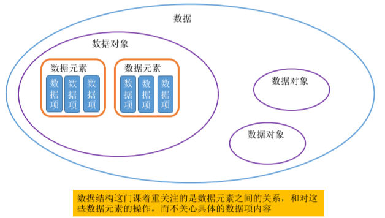

# 第一章:简介

## 1.1 数据结构的定义

- 数据： 数据是信息的载体，是描述客观事物属性的数、字符及所有能输入到计算机中并被计算机程序识别和处理的符号的集合。数据是计算机程序加工的原料。（二进制 0 和 1）

- 数据元素、数据项： 数据元素是数据的基本单位，通常作为一个整体进行考虑和处理。
  一个数据元素可由若干数据项组成，数据项是构成数据元素的不可分割的最小单位。
- 数据结构、数据对象： 数据结构是相互之间存在一种或多种特定关系的数据元素的集合。
  数据对象是具有相同性质的数据元素的集合，是数据的一个子集。
- 数据的运算：施加在数据上的运算包括运算的定义和实现。运算的定义是针对逻辑结构的， 指出运算的功能；运算的实现是针对存储结构的，指出运算的具体操作步骤。

### 数据类型、抽象数据类型 

数据类型是一个值的集合和定义在此集合上的一组操作的总称。

1. 原子类型：其值不可再分的数据类型。
2. 结构类型：其值可以再分解为若干成分（分量）的数据类型。
3. 抽象数据类型（Abstract Data Type，ADT）：是抽象数据组织及与之相关的操作

## 1.2 数据结构的重要性

## 1.3 常见的数据结构分类

| 数据结构                  | 变种                                                         |
| ------------------------- | ------------------------------------------------------------ |
| 顺序线性表：向量 Vector   |                                                              |
| 单链表 Singly Linked List | 1. 双向链表 Double Linked Lists 2. 静态链表 Static List 3. 对称矩阵 Symmetric Matrix 4. 稀疏矩阵 Sparse Matrix |
| 哈希表 Hash Table         | 1. 散列函数 Hash Function 2. 解决碰撞/填充因子 Collision Resolution |
| 栈和队列 Stack & Queue    | 1. 广义表 Generalized List/GList 2. 双端队列 Deque           |
| 队列 Queue                | 1. 链表实现 Linked List Implementation 2. 循环数组实现 ArrayQueue 3. 双端队列 Deque 4. 优先队列 Priority Queue 5. 循环队列 Circular Queue |
| 字符串 String             | 1. KMP 算法 2. 有限状态自动机 3. 模式匹配有限状态自动机 4. BM 模式匹配算法 5. BM-KMP 算法 6. BF 算法 |
| 树 Tree                   | 1. 二叉树 Binary Tree 2. 并查集 Union-Find 3. Huffman 树     |
| 数组实现的堆 Heap         | 1. 极大堆和极小堆 Max Heap and Min Heap 2. 极大极小堆 3. 双端堆 Deap 4. d 叉堆 |
| 树实现的堆 Heap           | 1. 左堆 Leftist Tree/Leftist Heap 2. 扁堆 3. 二项式堆 4. 斐波那契堆 Fibonacco Heap 5. 配对堆 Pairing Heap |
| 查找 Search               | 1. 哈希表 Hash 2. 跳跃表 Skip List 3. 排序二叉树 Binary Sort Tree 4. AVL 树 5. B 树 / B+ 树 / B* 树 6. AA 树 7. 红黑树 Red Black Tree 8. 排序二叉堆 Binary Heap 9. Splay 树 10. 双链树 Double Chained Tree 11. Trie 树 12. R 树 |

常见的数据结构包括数组、链表、栈、队列、哈希表、树、堆、图，它们可以从“逻辑结构”和“物理结构”两个维度进行分类。

### 逻辑结构：线性与非线性

**逻辑结构揭示了数据元素之间的逻辑关系**。在数组和链表中，数据按照一定顺序排列，体现了数据之间的线性关系；而在树中，数据从顶部向下按层次排列，表现出“祖先”与“后代”之间的派生关系；图则由节点和边构成，反映了复杂的网络关系。

如图 3-1 所示，逻辑结构可分为“线性”和“非线性”两大类。线性结构比较直观，指数据在逻辑关系上呈线性排列；非线性结构则相反，呈非线性排列。

- **线性数据结构**：数组、链表、栈、队列、哈希表。
- **非线性数据结构**：树、堆、图、哈希表。

  - **树形结构**：树、堆、哈希表，元素之间是一对多的关系。

  - **网状结构**：图，元素之间是多对多的关系。

值得说明的是，**所有数据结构都是基于数组、链表或二者的组合实现的**。例如，栈和队列既可以使用数组实现，也可以使用链表实现；而哈希表的实现可能同时包含数组和链表。

- **基于数组可实现**：栈、队列、哈希表、树、堆、图、矩阵、张量（维度 ≥3 的数组）等。
- **基于链表可实现**：栈、队列、哈希表、树、堆、图等。

基于数组实现的数据结构也称“静态数据结构”，这意味着此类数据结构在初始化后长度不可变。相对应地，基于链表实现的数据结构也称“动态数据结构”，这类数据结构在初始化后，仍可以在程序运行过程中对其长度进行调整。

### 逻辑结构——数据元素之间的逻辑关系是什么？

- 集合：各个元素同属一个集 合，别无其他关系
- 线性结构：数据元素之间是一对一的关系。 除了第一个元素，所有元素都有唯一前驱；除了最后一个元素，所有元素都有唯一后继
- 树形结构：数据元素之间是 一对多的关系
- 图状结构（网状结构）：数据元素之间是 多对多的关系

### 数据的物理结构（存储结构）——如何用计算机表示数据元素的逻辑关系？

- 顺序存储：把逻辑上相邻的元素存储在物理位置 上也相邻的存储单元中，元素之间的关系由存储单元的邻接关系来体现
- 链式存储：逻辑上相邻的元素在物理位置上可以 不相邻，借助指示元素存储地址的指针来表示元素之间的逻辑关系。
- 索引存储：在存储元素信息的同时，还建立附加 的索引表。索引表中的每项称为索引项，索引项 的一般形式是（关键字，地址）
- 散列存储：根据元素的关键字直接计算出该元素 的存储地址，又称哈希（Hash）存储

### 理解

1. 若采用顺序存储，则各个数据元素在物理上必须是连续的；若采用 非顺序存储，则各个数据元素在物理上可以是离散的。
2. 数据的存储结构会影响存储空间分配的方便程度
3. 数据的存储结构会影响对数据运算的速度

